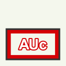
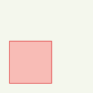
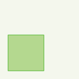
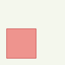

Zones
=====

Zone A
******

**Zone agricole**
        
Grande échelle (≥ 1:2500) :

.. image:: ../../../PLU/vignettes/ZONE-A_sup2500.png

.. code::

    Ligne simple
    • couleur : RVB 255,240,0 (#fff000)
    • décalage : 3 pt
    • largeur de trait : 7 pt
    • style de jointure : rond
    • style de trait : ligne continue

    Ligne simple
    • couleur : RVB 52,52,52 (#343434)
    • largeur de trait : 2.5 pt
    • style de jointure : angle droit
    • style de trait : ligne continue

Petite échelle (< 1:2500) :

.. code::

    Remplissage simple
    • couleur de remplissage : RVB 255,255,0 (#ffff00), transparence 40%
    • couleur de trait : RVB 52,52,52 (#343434)
    • largeur de trait : 0.8 pt
    • style de trait : ligne continue

Zone AUc
********

**Zone à urbaniser**
        
Grande échelle (≥ 1:2500) :

.. code::

    Ligne simple
    • couleur : RVB 212,0,6 (#d40006)
    • décalage : 3 pt
    • largeur de trait : 7 pt
    • style de jointure : rond
    • style de trait : ligne continue

    Ligne simple
    • couleur : RVB 52,52,52 (#343434)
    • largeur de trait : 2.5 pt
    • style de jointure : angle droit
    • style de trait : ligne continue

Petite échelle (< 1:2500) :

.. code::

    Remplissage simple
    • couleur de remplissage : RVB 255,101,101 (#ff6565), transparence 40%
    • couleur de trait : RVB 52,52,52 (#343434)
    • largeur de trait : 0.8 pt
    • style de trait : ligne continue

Zone AUs
********

**Zone à urbaniser bloquée**
        
Grande échelle (≥ 1:2500) :

.. code::

    Ligne simple
    • couleur : RVB 232,135,102 (#e88766)
    • décalage : 3 pt
    • largeur de trait : 7 pt
    • style de jointure : rond
    • style de trait : ligne continue

    Ligne simple
    • couleur : RVB 52,52,52 (#343434)
    • largeur de trait : 2.5 pt
    • style de jointure : angle droit
    • style de trait : ligne continue

Petite échelle (< 1:2500) :

.. image:: ../../../PLU/vignettes/ZONE-AUs_inf2500.png

.. code::

    Remplissage simple
    • couleur de remplissage : RVB 254,204,190 (#feccbe), transparence 40%
    • couleur de trait : RVB 52,52,52 (#343434)
    • largeur de trait : 0.8 pt
    • style de trait : ligne continue

Zone N
******

**Zone naturelle et forestière**
        
Grande échelle (≥ 1:2500) :

.. image:: ../../../PLU/vignettes/ZONE-N_sup2500.png

.. code::

    Ligne simple
    • couleur : RVB 35,166,0 (#23a600)
    • décalage : 3 pt
    • largeur de trait : 7 pt
    • style de jointure : rond
    • style de trait : ligne continue

    Ligne simple
    • couleur : RVB 52,52,52 (#343434)
    • largeur de trait : 2.5 pt
    • style de jointure : angle droit
    • style de trait : ligne continue

Petite échelle (< 1:2500) :

.. code::

    Remplissage simple
    • couleur de remplissage : RVB 86,170,2 (#56aa02), transparence 40%
    • couleur de trait : RVB 52,52,52 (#343434)
    • largeur de trait : 0.8 pt
    • style de trait : ligne continue

Zone U
******

**Zone urbaine**
        
Grande échelle (≥ 1:2500) :

.. image:: ../../../PLU/vignettes/ZONE-U_sup2500.png

.. code::

    Ligne simple
    • couleur : RVB 176,0,6 (#b00006)
    • décalage : 3 pt
    • largeur de trait : 7 pt
    • style de jointure : rond
    • style de trait : ligne continue

    Ligne simple
    • couleur : RVB 52,52,52 (#343434)
    • largeur de trait : 2.5 pt
    • style de jointure : angle droit
    • style de trait : ligne continue

Petite échelle (< 1:2500) :

.. code::
    
    Remplissage simple
    • couleur de remplissage : RVB 230,0,0 (#e60000), transparence 40%
    • couleur de trait : RVB 52,52,52 (#343434)
    • largeur de trait : 0.8 pt
    • style de trait : ligne continue
