## Informations


### Information 01-01

**Périmètre d'application du plan de sauvegarde et mise en valeur**
            
*Apparaît dans la légende nationale PSMV.*
        
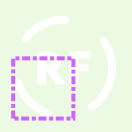

Géométrie surfacique :  
```
Ligne simple
• couleur : RVB 205,100,255 (#cd64ff)
• largeur de trait : 3 pt
• modèle de tiret personnalisé (tiret ; espace) : [6;2;3;2] pt
• style de cap : plat
• style de jointure : angle droit
```

Géométrie linéaire :  
*Pas de spécification.*

Géométrie ponctuelle :  
*Pas de spécification.*


### Information 02-00

**Zone d'aménagement concerté (R123-13 2)**
            
*Même symbole que pour les PLU.*
        
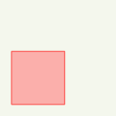

Géométrie surfacique :  
```
Remplissage simple
• couleur de remplissage : RVB 255,127,127 (#ff7f7f), transparence 60%
• couleur de trait : RVB 255,0,0 (#ff0000)
• largeur de trait : 1 pt
• style de trait : ligne continue
```

Géométrie linéaire :  
*Pas de spécification.*

Géométrie ponctuelle :  
*Pas de spécification.*


### Information 03-00

**Zone de préemption dans un espace naturel et sensible (R123-13 3)**
            
*Même symbole que pour les PLU.*
        
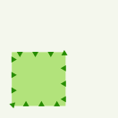

Géométrie surfacique :  
```
Ligne de symboles
• intervalle : 13 pt

    Symbole de police
    • caractère(s) : unicode 129
    • couleur de remplissage : RVB 38,140,0 (#268c00)
    • décalage (en x, en y) : 0,-2 pt
    • famille de police : Wingdings 3
    • rotation : 180°
    • taille : 8 pt

Remplissage simple
• couleur de remplissage : RVB 134,213,47 (#86d52f), transparence 40%
```

Géométrie linéaire :  
*Pas de spécification.*

Géométrie ponctuelle :  
*Pas de spécification.*


### Information 04-00

**Périmètre de droit de préemption urbain (R123-13 4)**
            
*Même symbole que pour les PLU.*
        
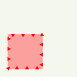

Géométrie surfacique :  
```
Ligne de symboles
• intervalle : 13 pt

    Symbole de police
    • caractère(s) : unicode 129
    • couleur de remplissage : RVB 255,0,0 (#ff0000)
    • décalage (en x, en y) : 0,-2 pt
    • famille de police : Wingdings 3
    • rotation : 180°
    • taille : 8 pt

Remplissage simple
• couleur de remplissage : RVB 255,101,101 (#ff6565), transparence 40%
```

Géométrie linéaire :  
*Pas de spécification.*

Géométrie ponctuelle :  
*Pas de spécification.*


### Information 04-01

**Périmètre de droit de préemption urbain renforcé**
            
*Même symbole que pour les PLU.*
        
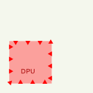

Géométrie surfacique :  
```
Ligne de symboles
• intervalle : 13 pt

    Symbole de police
    • caractère(s) : unicode 129
    • couleur de remplissage : RVB 255,0,0 (#ff0000)
    • décalage (en x, en y) : 0,-2 pt
    • famille de police : Wingdings 3
    • rotation : 180°
    • taille : 8 pt

Motif de points
• décalage horizontal : 25 pt
• décalage vertical : 25 pt
• distance horizontale : 50 pt
• distance verticale : 50 pt

    Symbole de police
    • caractère(s) : U (unicode 85)
    • couleur de remplissage : RVB 166,0,0 (#a60000)
    • décalage (en x, en y) : 10,0 pt
    • famille de police : Arial
    • taille : 7 pt

    Symbole de police
    • caractère(s) : P (unicode 80)
    • couleur de remplissage : RVB 166,0,0 (#a60000)
    • décalage (en x, en y) : 5,0 pt
    • famille de police : Arial
    • taille : 7 pt

    Symbole de police
    • caractère(s) : D (unicode 68)
    • couleur de remplissage : RVB 166,0,0 (#a60000)
    • famille de police : Arial
    • taille : 7 pt

Remplissage simple
• couleur de remplissage : RVB 255,101,101 (#ff6565), transparence 40%
```

Géométrie linéaire :  
*Pas de spécification.*

Géométrie ponctuelle :  
*Pas de spécification.*


### Information 05-00

**Zone d'aménagement différé (R123-13 4)**
            
*Même symbole que pour les PLU.*
        
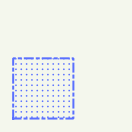

Géométrie surfacique :  
```
Motif de points
• distance horizontale : 4 pt
• distance verticale : 4 pt

    Symbole de police
    • caractère(s) : = (unicode 61)
    • couleur de remplissage : RVB 90,112,255 (#5a70ff)
    • famille de police : Webdings
    • taille : 2 pt

Ligne simple
• couleur : RVB 90,112,255 (#5a70ff)
• largeur de trait : 1.5 pt
• style de trait : ligne tiret-point
```

Géométrie linéaire :  
*Pas de spécification.*

Géométrie ponctuelle :  
*Pas de spécification.*


### Information 07-00

**Périmètre de développement prioritaire économie d'énergie (R123-13 6)**
            
*Même symbole que pour les PLU.*
        
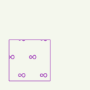

Géométrie surfacique :  
```
Motif de points
• déplacement horizontal : 12 pt
• distance horizontale : 24 pt
• distance verticale : 20 pt

    Symbole de police
    • caractère(s) : unicode 8734
    • couleur de remplissage : RVB 132,0,168 (#8400a8)
    • famille de police : Arial Black
    • style de jointure : rond
    • taille : 14 pt

Ligne simple
• couleur : RVB 132,0,168 (#8400a8)
• largeur de trait : 0.8 pt
• style de trait : ligne continue
```

Géométrie linéaire :  
*Pas de spécification.*

Géométrie ponctuelle :  
*Pas de spécification.*


### Information 08-00

**Périmètre forestier: Interdiction ou réglementation des plantations (code rural et de la pêche maritime), plantations à réaliser (R123-13 7)**
            
*Même symbole que pour les PLU.*
        
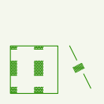

Géométrie surfacique :  
```
Motif de points
• décalage horizontal : 12 pt
• décalage vertical : -12 pt
• distance horizontale : 25 pt
• distance verticale : 25 pt

    Symbole de police
    • caractère(s) : unicode 9619
    • couleur de remplissage : RVB 38,140,0 (#268c00)
    • famille de police : Arial
    • taille : 12 pt

Ligne simple
• couleur : RVB 38,140,0 (#268c00)
• largeur de trait : 0.8 pt
• style de trait : ligne continue
```

Géométrie linéaire :  
```
Ligne de symboles
• décalage le long de la ligne : 22.5 pt
• intervalle : 30 pt

    Symbole de police
    • caractère(s) : unicode 9619
    • couleur de remplissage : RVB 38,140,0 (#268c00)
    • famille de police : Arial
    • taille : 8 pt

Ligne simple
• couleur : RVB 38,140,0 (#268c00)
• largeur de trait : 0.8 pt
• modèle de tiret personnalisé (tiret ; espace) : 15;15 pt
```

Géométrie ponctuelle :  
*Pas de spécification.*


### Information 09-00

**Périmètre minier de concession pour l'exploitation ou le stockage (R123-13 8)**
            
*Même symbole que pour les PLU.*
        
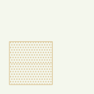

Géométrie surfacique :  
```
Motif de points
• distance horizontale : 15.95 pt
• distance verticale : 25.5 pt

    Symbole de police
    • caractère(s) : unicode 9618
    • couleur de remplissage : RVB 205,170,102 (#cdaa66)
    • famille de police : Arial
    • taille : 22 pt

Ligne simple
• couleur : RVB 205,170,102 (#cdaa66)
• largeur de trait : 0.8 pt
• style de trait : ligne continue
```

Géométrie linéaire :  
*Pas de spécification.*

Géométrie ponctuelle :  
*Pas de spécification.*


### Information 10-00

**Zone de recherche et d'exploitation de carrière (R123-13 9)**
            
*Même symbole que pour les PLU.*
        
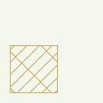

Géométrie surfacique :  
```
Motif de lignes
• décalage : 148 pt
• espacement : 8.5 pt
• rotation : 45°

    Ligne simple
    • couleur : RVB 168,112,0 (#a87000)
    • largeur de trait : 0.8 pt
    • style de trait : ligne continue

Motif de lignes
• décalage : 153 pt
• espacement : 25 pt
• rotation : 135°

    Ligne simple
    • couleur : RVB 168,112,0 (#a87000)
    • largeur de trait : 0.8 pt
    • style de trait : ligne continue

Ligne simple
• couleur : RVB 168,112,0 (#a87000)
• largeur de trait : 0.8 pt
• style de trait : ligne continue
```

Géométrie linéaire :  
*Pas de spécification.*

Géométrie ponctuelle :  
*Pas de spécification.*


### Information 11-00

**Périmètre des zones délimitées – divisions foncières soumises à déclaration préalable (R123-13 10)**
            
*Même symbole que pour les PLU.*
        
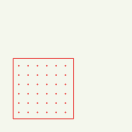

Géométrie surfacique :  
```
Motif de points
• distance horizontale : 7 pt
• distance verticale : 7 pt

    Symbole de police
    • caractère(s) : l (unicode 108)
    • couleur de remplissage : RVB 230,0,0 (#e60000)
    • famille de police : Wingdings
    • taille : 2 pt

Ligne simple
• couleur : RVB 230,0,0 (#e60000)
• largeur de trait : 0.8 pt
• style de trait : ligne continue
```

Géométrie linéaire :  
*Pas de spécification.*

Géométrie ponctuelle :  
*Pas de spécification.*


### Information 12-00

**Périmètre de sursis à statuer (R123-13 11)**
            
*Même symbole que pour les PLU.*
        


Géométrie surfacique :  
```
Remplissage simple
• couleur de trait : RVB 0,77,168 (#004da8)
• largeur de trait : 2.5 pt
• style de remplissage : pas de remplissage
• style de trait : ligne continue
```

Géométrie linéaire :  
*Pas de spécification.*

Géométrie ponctuelle :  
*Pas de spécification.*


### Information 13-00

**Secteur de programme d'aménagement d'ensemble (R123-13 12)**
            
*Même symbole que pour les PLU.*
        
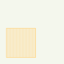

Géométrie surfacique :  
```
Motif de lignes
• espacement : 3 pt
• rotation : 90°

    Ligne simple
    • couleur : RVB 255,211,127 (#ffd37f)
    • largeur de trait : 0.8 pt
    • style de trait : ligne continue

Ligne simple
• couleur : RVB 255,211,127 (#ffd37f)
• largeur de trait : 0.8 pt
• style de trait : ligne continue
```

Géométrie linéaire :  
*Pas de spécification.*

Géométrie ponctuelle :  
*Pas de spécification.*


### Information 14-00

**Périmètre de voisinage d'infrastructure de transport terrestre (R123-13 12)**
            
*Même symbole que pour les PLU.*
        
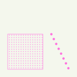

Géométrie surfacique :  
```
Motif de points
• distance horizontale : 3 pt
• distance verticale : 3 pt

    Symbole de police
    • caractère(s) : l (unicode 108)
    • couleur de remplissage : RVB 255,115,223 (#ff73df)
    • famille de police : Wingdings
    • taille : 2 pt

Ligne simple
• couleur : RVB 255,115,223 (#ff73df)
• largeur de trait : 0.8 pt
• style de trait : ligne continue
```

Géométrie linéaire :  
```
Ligne de symboles
• intervalle : 7 pt

    Symbole de police
    • caractère(s) : l (unicode 108)
    • couleur de remplissage : RVB 255,115,223 (#ff73df)
    • famille de police : Wingdings
    • taille : 5 pt
```

Géométrie ponctuelle :  
*Pas de spécification.*


### Information 16-00

**Site archéologique**
            
*Même symbole que pour les PLU.*
        
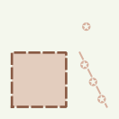

Géométrie surfacique :  
```
Remplissage simple
• couleur de remplissage : RVB 215,176,158 (#d7b09e), transparence 40%
• style de trait : pas de ligne

Ligne simple
• couleur : RVB 137,90,68 (#895a44)
• largeur de trait : 2 pt
• style de trait : ligne en tiret
```

Géométrie linéaire :  
```
Ligne de symboles
• décalage le long de la ligne : 11 pt
• intervalle : 16 pt

    Symbole de police
    • caractère(s) : unicode 181
    • couleur de remplissage : RVB 215,176,158 (#d7b09e)
    • famille de police : Wingdings
    • taille : 10 pt

Ligne simple
• couleur : RVB 215,176,158 (#d7b09e)
• largeur de trait : 1.5 pt
• modèle de tiret personnalisé (tiret ; espace) : 6;10 pt
```

Géométrie ponctuelle :  
```
Symbole de police
• caractère(s) : unicode 181
• couleur de remplissage : RVB 215,176,158 (#d7b09e)
• famille de police : Wingdings
• taille : 10 pt
```


### Information 17-00

**Zone à risque d'exposition au plomb (R123-13 14)**
            
*Même symbole que pour les PLU.*
        
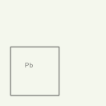

Géométrie surfacique :  
```
Motif de points
• décalage horizontal : 25 pt
• décalage vertical : 35 pt
• déplacement vertical : 25 pt
• distance horizontale : 50 pt
• distance verticale : 50 pt

    Symbole de police
    • caractère(s) : b (unicode 98)
    • couleur de remplissage : RVB 52,52,52 (#343434)
    • décalage (en x, en y) : 4,0 pt
    • famille de police : Arial
    • taille : 6 pt

    Symbole de police
    • caractère(s) : P (unicode 80)
    • couleur de remplissage : RVB 52,52,52 (#343434)
    • famille de police : Arial
    • taille : 6 pt

Ligne simple
• couleur : RVB 52,52,52 (#343434)
• largeur de trait : 1 pt
• style de trait : ligne continue
```

Géométrie linéaire :  
*Pas de spécification.*

Géométrie ponctuelle :  
*Pas de spécification.*


### Information 19-01

**Zones d'assainissement collectif/non collectif / eaux usées/eaux pluviales, schéma de réseaux eau et assainissement, systèmes d'élimination des déchets (R 123-14 3)**
            
*Même symbole que pour les PLU.*
        
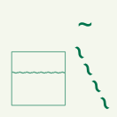

Géométrie surfacique :  
```
Motif de points
• distance horizontale : 6 pt
• distance verticale : 30 pt

    Symbole de police
    • caractère(s) : ~ (unicode 126)
    • couleur de remplissage : RVB 0,115,76 (#00734c)
    • famille de police : Arial
    • taille : 12 pt

Ligne simple
• couleur : RVB 0,115,76 (#00734c)
• largeur de trait : 0.8 pt
• style de trait : ligne continue
```

Géométrie linéaire :  
```
Ligne de symboles
• décalage le long de la ligne : 1 pt
• intervalle : 16 pt

    Symbole de police
    • caractère(s) : ~ (unicode 126)
    • couleur de remplissage : RVB 0,115,76 (#00734c)
    • décalage (en x, en y) : 0,-3 pt
    • famille de police : Arial
    • taille : 22 pt
```

Géométrie ponctuelle :  
```
Symbole de police
• caractère(s) : ~ (unicode 126)
• couleur de remplissage : RVB 0,115,76 (#00734c)
• décalage (en x, en y) : 0,-3 pt
• famille de police : Arial
• taille : 22 pt
```


### Information 19-02

**Emplacements traitement eaux et déchets**

*Mêmes figurés que le sous-code [19-01](#information-19-01).*


### Information 20-00

**Règlement local de publicité**
            
*Même symbole que pour les PLU.*
        
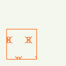

Géométrie surfacique :  
```
Motif de points
• déplacement horizontal : 15 pt
• distance horizontale : 30 pt
• distance verticale : 30 pt

    Symbole simple
    • couleur de remplissage : transparent
    • couleur de trait : RVB 255,85,0 (#ff5500)
    • largeur de trait : 0.8 pt
    • nom du symbole : half_square
    • style de trait : ligne continue
    • taille : 8 pt

Motif de points
• déplacement horizontal : 15 pt
• distance horizontale : 30 pt
• distance verticale : 30 pt

    Symbole simple
    • couleur de trait : RVB 255,85,0 (#ff5500)
    • décalage (en x, en y) : -2,0 pt
    • largeur de trait : 0.8 pt
    • nom du symbole : cross2
    • style de trait : ligne continue
    • taille : 10 pt

Ligne simple
• couleur : RVB 255,85,0 (#ff5500)
• largeur de trait : 0.8 pt
• style de trait : ligne continue
```

Géométrie linéaire :  
*Pas de spécification.*

Géométrie ponctuelle :  
*Pas de spécification.*


### Information 21-00

**Projet PPRN et PPRM (R123-14 7)**
            
*Même symbole que pour les PLU.*
        
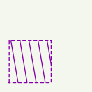

Géométrie surfacique :  
```
Motif de lignes
• espacement : 10 pt
• rotation : 100°

    Ligne simple
    • couleur : RVB 132,0,168 (#8400a8)
    • largeur de trait : 1 pt
    • style de trait : ligne continue

Ligne simple
• couleur : RVB 132,0,168 (#8400a8)
• largeur de trait : 1 pt
• modèle de tiret personnalisé (tiret ; espace) : 3;3 pt
```

Géométrie linéaire :  
*Pas de spécification.*

Géométrie ponctuelle :  
*Pas de spécification.*


### Information 22-00

**Protection des rives des  plans d'eau en zone de montagne (L145-5 et R145-3)**
            
*Même symbole que pour les PLU.*
        
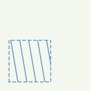

Géométrie surfacique :  
```
Motif de lignes
• espacement : 10 pt
• rotation : 100°

    Ligne simple
    • couleur : RVB 0,77,168 (#004da8)
    • largeur de trait : 1 pt
    • style de trait : ligne continue

Ligne simple
• couleur : RVB 0,77,168 (#004da8)
• largeur de trait : 1 pt
• modèle de tiret personnalisé (tiret ; espace) : 3;3 pt
```

Géométrie linéaire :  
*Pas de spécification.*

Géométrie ponctuelle :  
*Pas de spécification.*


### Information 23-00

**Arrêté du préfet coordonnateur de massif (L145-5)**
            
*Même symbole que pour les PLU.*
        
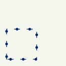

Géométrie surfacique :  
```
Ligne de symboles
• décalage le long de la ligne : 4 pt
• intervalle : 19 pt

    Symbole simple
    • couleur de remplissage : RVB 0,38,115 (#002673)
    • nom du symbole : circle
    • taille : 4 pt

Ligne simple
• couleur : RVB 0,38,115 (#002673)
• largeur de trait : 1 pt
• modèle de tiret personnalisé (tiret ; espace) : 8;11 pt
```

Géométrie linéaire :  
*Pas de spécification.*

Géométrie ponctuelle :  
*Pas de spécification.*


### Information 25-00

**Périmètre de protection des espaces agricoles et naturels péri-urbains (L143-1 et R123-13 15)**
            
*Même symbole que pour les PLU.*
        


Géométrie surfacique :  
```
Motif de lignes
• espacement : 10 pt
• rotation : 100°

    Ligne simple
    • couleur : RVB 230,230,0 (#e6e600)
    • largeur de trait : 1 pt
    • style de trait : ligne continue

Ligne simple
• couleur : RVB 230,230,0 (#e6e600)
• largeur de trait : 1 pt
• modèle de tiret personnalisé (tiret ; espace) : 3;3 pt
```

Géométrie linéaire :  
*Pas de spécification.*

Géométrie ponctuelle :  
*Pas de spécification.*


### Information 27-00

**Plan d'exposition au bruit des aérodromes (L147-1 à L147-6 et R123-13 4)**
            
*Même symbole que pour les PLU.*
        
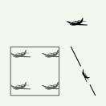

Géométrie surfacique :  
```
Motif de points
• décalage horizontal : -11 pt
• décalage vertical : -11 pt
• distance horizontale : 30 pt
• distance verticale : 30 pt

    Symbole de police
    • caractère(s) : j (unicode 106)
    • couleur de remplissage : RVB 0,0,0 (#000000)
    • famille de police : Webdings
    • taille : 23 pt

Ligne simple
• couleur : RVB 0,0,0 (#000000)
• largeur de trait : 0.8 pt
• style de trait : ligne continue
```

Géométrie linéaire :  
```
Ligne de symboles
• décalage le long de la ligne : 30 pt
• intervalle : 40 pt

    Symbole de police
    • caractère(s) : j (unicode 106)
    • couleur de remplissage : RVB 0,0,0 (#000000)
    • décalage (en x, en y) : 0,-2 pt
    • famille de police : Webdings
    • taille : 15 pt

Ligne simple
• couleur : RVB 0,0,0 (#000000)
• largeur de trait : 0.8 pt
• modèle de tiret personnalisé (tiret ; espace) : 20;20 pt
```

Géométrie ponctuelle :  
```
Symbole de police
• caractère(s) : j (unicode 106)
• couleur de remplissage : RVB 0,0,0 (#000000)
• décalage (en x, en y) : 0,-2 pt
• famille de police : Webdings
• taille : 23 pt
```


### Information 30-00

**Périmètre PUP (L332-11-3 et R123-13 17)**
            
*Même symbole que pour les PLU.*
        
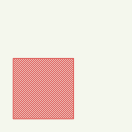

Géométrie surfacique :  
```
Motif de lignes
• espacement : 1.3 pt
• rotation : 45°

    Ligne simple
    • couleur : RVB 210,4,4 (#d20404), transparence 40%
    • largeur de trait : 0.8 pt
    • style de trait : ligne continue

Ligne simple
• couleur : RVB 210,4,4 (#d20404)
• largeur de trait : 0.8 pt
• style de trait : ligne continue
```

Géométrie linéaire :  
*Pas de spécification.*

Géométrie ponctuelle :  
*Pas de spécification.*


### Information 31-00

**Périmètre patrimonial d'exclusion des matériaux et énergies renouvelables pris par délibération**
            
*Même symbole que pour les PLU.*
        
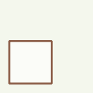

Géométrie surfacique :  
```
Remplissage simple
• couleur de remplissage : RVB 255,255,255 (#ffffff), transparence 40%
• couleur de trait : RVB 137,90,68 (#895a44)
• largeur de trait : 2 pt
• style de trait : ligne continue
```

Géométrie linéaire :  
*Pas de spécification.*

Géométrie ponctuelle :  
*Pas de spécification.*


### Information 32-00

**Secteur à fiscalité particulière en application du L331-14 (taxe d'aménagement) R123-13 19**
            
*Même symbole que pour les PLU.*
        
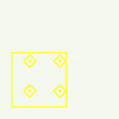

Géométrie surfacique :  
```
Motif de points
• distance horizontale : 25 pt
• distance verticale : 25 pt

    Symbole de police
    • caractère(s) : unicode 176
    • couleur de remplissage : RVB 255,255,0 (#ffff00)
    • famille de police : Wingdings 2
    • taille : 14 pt

Ligne simple
• couleur : RVB 255,255,0 (#ffff00)
• largeur de trait : 0.8 pt
• style de trait : ligne continue
```

Géométrie linéaire :  
*Pas de spécification.*

Géométrie ponctuelle :  
*Pas de spécification.*


### Information 33-00

**Droit de préemption commercial (L214-1, R214-1 et 2)**
            
*Même symbole que pour les PLU.*
        
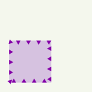

Géométrie surfacique :  
```
Ligne de symboles
• intervalle : 11 pt

    Symbole de police
    • caractère(s) : p (unicode 112)
    • couleur de remplissage : RVB 132,0,168 (#8400a8)
    • décalage (en x, en y) : 0,-3 pt
    • famille de police : Wingdings 3
    • rotation : 180°
    • taille : 6 pt

Remplissage simple
• couleur de remplissage : RVB 194,158,215 (#c29ed7), transparence 40%
• style de trait : pas de ligne
```

Géométrie linéaire :  
*Pas de spécification.*

Géométrie ponctuelle :  
*Pas de spécification.*


### Information 34-00

**Périmètre d'opération d'intérêt national (L121-2 et L121-9-1, R121-4-1)**
            
*Même symbole que pour les PLU.*
        
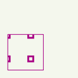

Géométrie surfacique :  
```
Motif de points
• décalage horizontal : 9 pt
• décalage vertical : 14 pt
• distance horizontale : 30 pt
• distance verticale : 30 pt

    Symbole de police
    • caractère(s) : unicode 164
    • couleur de remplissage : RVB 168,0,132 (#a80084)
    • famille de police : Wingdings 2
    • taille : 12 pt

Ligne simple
• couleur : RVB 168,0,132 (#a80084)
• largeur de trait : 0.8 pt
• style de trait : ligne continue
```

Géométrie linéaire :  
*Pas de spécification.*

Géométrie ponctuelle :  
*Pas de spécification.*


### Information 35-00

**Périmètre de secteur affecté par un seuil minimal de densité (L331-36, R123-13 20)**
            
*Même symbole que pour les PLU.*
        
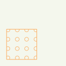

Géométrie surfacique :  
```
Motif de points
• décalage horizontal : 26 pt
• décalage vertical : -12 pt
• distance horizontale : 14 pt
• distance verticale : 14 pt

    Symbole de police
    • caractère(s) : unicode 161
    • couleur de remplissage : RVB 255,122,0 (#ff7a00)
    • famille de police : Wingdings
    • taille : 9 pt

Ligne simple
• couleur : RVB 255,122,0 (#ff7a00)
• largeur de trait : 0.8 pt
• style de trait : ligne continue
```

Géométrie linéaire :  
*Pas de spécification.*

Géométrie ponctuelle :  
*Pas de spécification.*


### Information 36-00

**Schémas d'aménagement de plage**
            
*Même symbole que pour les PLU.*
        
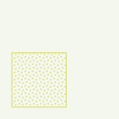

Géométrie surfacique :  
```
Motif de points
• déplacement horizontal : 1 pt
• déplacement vertical : 1 pt
• distance horizontale : 3 pt
• distance verticale : 3 pt

    Symbole de police
    • caractère(s) : l (unicode 108)
    • couleur de remplissage : RVB 204,206,59 (#ccce3b)
    • famille de police : Wingdings
    • taille : 2 pt

Ligne simple
• couleur : RVB 204,206,59 (#ccce3b)
• largeur de trait : 0.8 pt
• style de trait : ligne continue
```

Géométrie linéaire :  
*Pas de spécification.*

Géométrie ponctuelle :  
*Pas de spécification.*


### Information 37-00

**Bois ou forêts relevant du régime forestier**
            
*Même symbole que pour les PLU.*
        
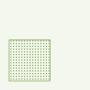

Géométrie surfacique :  
```
Motif de points
• distance horizontale : 3 pt
• distance verticale : 3 pt

    Symbole simple
    • couleur de remplissage : RVB 72,130,15 (#48820f)
    • nom du symbole : circle
    • taille : 1.5 pt

Ligne simple
• couleur : RVB 72,130,15 (#48820f)
• largeur de trait : 0.8 pt
• style de trait : ligne continue
```

Géométrie linéaire :  
*Pas de spécification.*

Géométrie ponctuelle :  
*Pas de spécification.*


### Information 38-00

**Secteurs d'informations sur les sols**
            
*Même symbole que pour les PLU.*
        
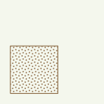

Géométrie surfacique :  
```
Motif de points
• déplacement horizontal : 1 pt
• déplacement vertical : 1 pt
• distance horizontale : 3 pt
• distance verticale : 3 pt

    Symbole de police
    • caractère(s) : l (unicode 108)
    • couleur de remplissage : RVB 144,112,76 (#90704c)
    • famille de police : Wingdings
    • taille : 2 pt

Ligne simple
• couleur : RVB 144,112,76 (#90704c)
• largeur de trait : 0.8 pt
• style de trait : ligne continue
```

Géométrie linéaire :  
*Pas de spécification.*

Géométrie ponctuelle :  
*Pas de spécification.*


### Information 39-00

**Périmètres de projets AFUP (dans lesquels les propriétaires fonciers sont incités à se regrouper en AFU de projet et les AFU de projet à mener leurs opérations de façon concertée)**
            
*Même symbole que pour les PLU.*
        
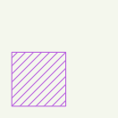

Géométrie surfacique :  
```
Motif de lignes
• espacement : 5 pt
• rotation : 45°

    Ligne simple
    • couleur : RVB 146,0,214 (#9200d6)
    • largeur de trait : 0.8 pt
    • style de trait : ligne continue

Ligne simple
• couleur : RVB 146,0,214 (#9200d6)
• largeur de trait : 0.8 pt
• style de trait : ligne continue
```

Géométrie linéaire :  
*Pas de spécification.*

Géométrie ponctuelle :  
*Pas de spécification.*


### Information 40-01

**Périmètre d'un bien inscrit au patrimoine mondial**
            
*Même symbole que pour les PLU.*
        
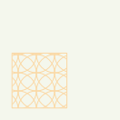

Géométrie surfacique :  
```
Motif de points
• distance horizontale : 15 pt
• distance verticale : 15 pt

    Symbole simple
    • couleur de remplissage : transparent
    • couleur de trait : RVB 255,196,118 (#ffc476)
    • largeur de trait : 0.8 pt
    • nom du symbole : circle
    • style de trait : ligne continue
    • taille : 30 pt

Ligne simple
• couleur : RVB 255,196,118 (#ffc476)
• largeur de trait : 0.8 pt
• style de trait : ligne continue
```

Géométrie linéaire :  
*Pas de spécification.*

Géométrie ponctuelle :  
*Pas de spécification.*


### Information 40-02

**Zone tampon d'un bien inscrit au patrimoine mondial**
            
*Même symbole que pour les PLU.*
        
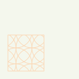

Géométrie surfacique :  
```
Motif de points
• distance horizontale : 30 pt
• distance verticale : 30 pt

    Symbole simple
    • couleur de remplissage : transparent
    • couleur de trait : RVB 255,196,147 (#ffc493)
    • largeur de trait : 0.8 pt
    • nom du symbole : circle
    • style de trait : ligne continue
    • taille : 60 pt

Ligne simple
• couleur : RVB 255,196,147 (#ffc493)
• largeur de trait : 0.8 pt
• style de trait : ligne continue
```

Géométrie linéaire :  
*Pas de spécification.*

Géométrie ponctuelle :  
*Pas de spécification.*


### Information 41-00

**Bande non constructible de part et d'autre de l'axe des voies (L111-6)**
            
*Même symbole que pour les PLU.*
        
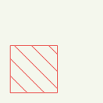

Géométrie surfacique :  
```
Motif de lignes
• espacement : 12 pt
• rotation : -45°

    Ligne simple
    • couleur : RVB 230,0,0 (#e60000)
    • largeur de trait : 0.8 pt
    • style de trait : ligne continue

Ligne simple
• couleur : RVB 230,0,0 (#e60000)
• largeur de trait : 0.8 pt
• style de trait : ligne continue
```

Géométrie linéaire :  
*Pas de spécification.*

Géométrie ponctuelle :  
*Pas de spécification.*


### Information 70-00

**Emprise ou localisation des immeubles bâtis ou non bâtis classés ou inscrits au titre des monuments historiques**
            
*Apparaît dans la légende nationale PSMV.*
        
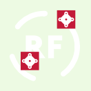

Géométrie surfacique :  
```
Remplissage de centroïde
• dessiner le point sur toutes les parties d'une entité multi-parties : oui
• forcer le point dans le polygone : oui

    Symbole SVG
    • fichier : /PSMV/SVG/psmv_info_70_00.svg
    • taille : 20 pt
```

Géométrie linéaire :  
*Pas de spécification.*

Géométrie ponctuelle :  
```
Symbole SVG
• fichier : /PSMV/SVG/psmv_info_70_00.svg
• taille : 20 pt
```


### Information 97-00

**Périmètre d'application d'une pièce écrite territorialisée relative aux annexes (liste des annexes, liste des SUP, plan des SUP)**
            
*Même symbole que pour les PLU.*
        


Géométrie surfacique :  
```
Remplissage simple
• style de remplissage : pas de remplissage
• style de trait : pas de ligne
```

Géométrie linéaire :  
*Pas de spécification.*

Géométrie ponctuelle :  
*Pas de spécification.*


### Information 98-00

**Périmètre d'annulation partielle du document d'urbanisme (lorsqu'elle impacte le règlement graphique)**
            
*Même symbole que pour les PLU.*
        


Géométrie surfacique :  
```
Remplissage simple
• couleur de remplissage : RVB 0,0,0 (#000000)
```

Géométrie linéaire :  
*Pas de spécification.*

Géométrie ponctuelle :  
*Pas de spécification.*


### Information 99-00

**Autre périmètre, secteur, plan, document, site, projet, espace.**
            
*Même symbole que pour les PLU.*
        
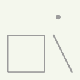

Géométrie surfacique :  
```
Remplissage simple
• couleur de trait : RVB 156,156,156 (#9c9c9c)
• largeur de trait : 2 pt
• style de remplissage : pas de remplissage
• style de trait : ligne continue
```

Géométrie linéaire :  
```
Ligne simple
• couleur : RVB 156,156,156 (#9c9c9c)
• largeur de trait : 2 pt
• style de trait : ligne continue
```

Géométrie ponctuelle :  
```
Symbole simple
• couleur de remplissage : RVB 156,156,156 (#9c9c9c)
• nom du symbole : circle
• taille : 6 pt
```


### Information 99-01

**Autre relevant de la loi littoral**

*Mêmes figurés que le sous-code [99-00](#information-99-00).*


### Information 99-02

**Autre relevant de la loi montagne**

*Mêmes figurés que le sous-code [99-00](#information-99-00).*