## Prescriptions


### Prescription 01-00

**Espace boisé classé**
            
- [ ] Même symbole que pour les PLU.
- [x] Apparaît dans la légende nationale PSMV.
        
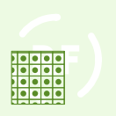

Géométrie surfacique :  
```
Motif de points
• distance horizontale : 10 pt
• distance verticale : 10 pt

    Symbole simple
    • couleur de remplissage : transparent
    • couleur de trait : RVB 90,140,40 (#5a8c28)
    • largeur de trait : 0.8 pt
    • nom du symbole : square
    • style de trait : ligne continue
    • taille : 10 pt

    Symbole simple
    • couleur de remplissage : RVB 90,140,40 (#5a8c28)
    • nom du symbole : circle
    • taille : 5 pt

Ligne simple
• couleur : RVB 90,140,40 (#5a8c28)
• largeur de trait : 0.8 pt
• style de trait : ligne continue
```

Géométrie linéaire :  
*Pas de spécification.*

Géométrie ponctuelle :  
*Pas de spécification.*


### Prescription 01-01

**Espace boisé classé à protéger ou conserver**

*Mêmes figurés que le sous-code [01-00](#prescription-01-00).*


### Prescription 01-02

**Espace boisé classé à créer**

*Mêmes figurés que le sous-code [01-00](#prescription-01-00).*


### Prescription 01-03

**Espace boisé classé significatif au titre de la loi littoral**

*Mêmes figurés que le sous-code [01-00](#prescription-01-00).*


### Prescription 02-00

**Limitation de la constructibilité pour des raisons environnementales**
            
- [x] Même symbole que pour les PLU.
- [ ] Apparaît dans la légende nationale PSMV.
        
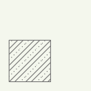

Géométrie surfacique :  
```
Motif de lignes
• décalage : 4 pt
• espacement : 13 pt
• rotation : 45°

    Ligne de symboles
    • intervalle : 4 pt

        Symbole simple
        • couleur de remplissage : RVB 110,110,110 (#6e6e6e)
        • nom du symbole : circle
        • style de jointure : angle droit
        • taille : 1 pt

Motif de lignes
• décalage : 9 pt
• espacement : 13 pt
• rotation : 45°

    Ligne simple
    • couleur : RVB 110,110,110 (#6e6e6e)
    • largeur de trait : 0.8 pt
    • style de cap : plat
    • style de jointure : angle droit
    • style de trait : ligne continue

Motif de lignes
• espacement : 13 pt
• rotation : 45°

    Ligne simple
    • couleur : RVB 110,110,110 (#6e6e6e)
    • largeur de trait : 0.8 pt
    • style de cap : plat
    • style de jointure : angle droit
    • style de trait : ligne continue

Ligne simple
• couleur : RVB 110,110,110 (#6e6e6e)
• largeur de trait : 0.8 pt
• style de trait : ligne continue
```

Géométrie linéaire :  
*Pas de spécification.*

Géométrie ponctuelle :  
*Pas de spécification.*


### Prescription 02-01

**Secteur avec interdiction de constructibilité pour des raisons environnementales, de risques, d'intérêt général**
            
- [x] Même symbole que pour les PLU.
- [ ] Apparaît dans la légende nationale PSMV.
        
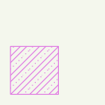

Géométrie surfacique :  
```
Motif de lignes
• décalage : 4 pt
• espacement : 13 pt
• rotation : 45°

    Ligne de symboles
    • intervalle : 4 pt

        Symbole simple
        • couleur de remplissage : RVB 223,115,225 (#df73e1)
        • nom du symbole : circle
        • style de jointure : angle droit
        • taille : 1 pt

Motif de lignes
• décalage : 9 pt
• espacement : 13 pt
• rotation : 45°

    Ligne simple
    • couleur : RVB 223,115,225 (#df73e1)
    • largeur de trait : 0.8 pt
    • style de cap : plat
    • style de jointure : angle droit
    • style de trait : ligne continue

Motif de lignes
• espacement : 13 pt
• rotation : 45°

    Ligne simple
    • couleur : RVB 223,115,225 (#df73e1)
    • largeur de trait : 0.8 pt
    • style de cap : plat
    • style de jointure : angle droit
    • style de trait : ligne continue

Ligne simple
• couleur : RVB 223,115,225 (#df73e1)
• largeur de trait : 0.8 pt
• style de trait : ligne continue
```

Géométrie linéaire :  
*Pas de spécification.*

Géométrie ponctuelle :  
*Pas de spécification.*


### Prescription 02-02

**Secteur avec conditions spéciales de constructibilité pour des raisons environnementales, de risques, d'intérêt général**
            
- [x] Même symbole que pour les PLU.
- [ ] Apparaît dans la légende nationale PSMV.
        
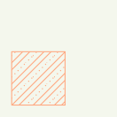

Géométrie surfacique :  
```
Motif de lignes
• décalage : 4 pt
• espacement : 13 pt
• rotation : 45°

    Ligne de symboles
    • intervalle : 4 pt

        Symbole simple
        • couleur de remplissage : RVB 255,167,127 (#ffa77f)
        • nom du symbole : circle
        • style de jointure : angle droit
        • taille : 1 pt

Motif de lignes
• décalage : 9 pt
• espacement : 13 pt
• rotation : 45°

    Ligne simple
    • couleur : RVB 255,167,127 (#ffa77f)
    • largeur de trait : 0.8 pt
    • style de cap : plat
    • style de jointure : angle droit
    • style de trait : ligne continue

Motif de lignes
• espacement : 13 pt
• rotation : 45°

    Ligne simple
    • couleur : RVB 255,167,127 (#ffa77f)
    • largeur de trait : 0.8 pt
    • style de cap : plat
    • style de jointure : angle droit
    • style de trait : ligne continue

Ligne simple
• couleur : RVB 255,167,127 (#ffa77f)
• largeur de trait : 0.8 pt
• style de trait : ligne continue
```

Géométrie linéaire :  
*Pas de spécification.*

Géométrie ponctuelle :  
*Pas de spécification.*


### Prescription 03-00

**Secteur avec disposition de reconstruction / démolition**
            
- [x] Même symbole que pour les PLU.
- [ ] Apparaît dans la légende nationale PSMV.
        
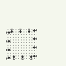

Géométrie surfacique :  
```
Ligne de symboles
• décalage le long de la ligne : 1 pt
• intervalle : 13 pt

    Symbole de police
    • caractère(s) : unicode 183
    • couleur de remplissage : RVB 52,52,52 (#343434)
    • décalage (en x, en y) : 0,3 pt
    • famille de police : Wingdings 2
    • taille : 10 pt

Motif de points
• distance horizontale : 4 pt
• distance verticale : 4 pt

    Symbole de police
    • caractère(s) : = (unicode 61)
    • couleur de remplissage : RVB 104,104,104 (#686868)
    • famille de police : Webdings
    • taille : 2 pt

Ligne simple
• couleur : RVB 52,52,52 (#343434)
• largeur de trait : 1 pt
• modèle de tiret personnalisé (tiret ; espace) : 2;11 pt
```

Géométrie linéaire :  
*Pas de spécification.*

Géométrie ponctuelle :  
*Pas de spécification.*


### Prescription 03-01

**[réservé aux cartes communales] Secteur dans lequel la reconstruction à l'indentique d'un bâtiment détruit par un sinistre n'est pas autorisée**

*Mêmes figurés que le sous-code [03-00](#prescription-03-00).*


### Prescription 03-02

**Secteur dans lequel la reconstruction à l'indentique d'un bâtiment détruit par un sinistre n'est pas autorisée**

*Mêmes figurés que le sous-code [03-00](#prescription-03-00).*


### Prescription 03-50

**Immeuble ou partie d'immeuble dont la modification peut être imposée à l’occasion d'opérations d'aménagement publiques ou privées**
            
- [ ] Même symbole que pour les PLU.
- [x] Apparaît dans la légende nationale PSMV.
        
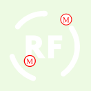

Géométrie surfacique :  
```
Remplissage de centroïde
• dessiner le point sur toutes les parties d'une entité multi-parties : oui
• forcer le point dans le polygone : oui

    Symbole de police
    • caractère(s) : M (unicode 77)
    • couleur de remplissage : RVB 255,0,0 (#ff0000)
    • décalage (en x, en y) : 0,-1 pt
    • famille de police : Times New Roman
    • taille : 8 pt

    Symbole simple
    • couleur de remplissage : RVB 255,255,255 (#ffffff)
    • couleur de trait : RVB 255,0,0 (#ff0000)
    • largeur de trait : 1 pt
    • nom du symbole : circle
    • style de trait : ligne continue
    • taille : 12 pt
```

Géométrie linéaire :  
*Pas de spécification.*

Géométrie ponctuelle :  
```
Symbole de police
• caractère(s) : M (unicode 77)
• couleur de remplissage : RVB 255,0,0 (#ff0000)
• décalage (en x, en y) : 0,-1 pt
• famille de police : Times New Roman
• taille : 8 pt

Symbole simple
• couleur de remplissage : RVB 255,255,255 (#ffffff)
• couleur de trait : RVB 255,0,0 (#ff0000)
• largeur de trait : 0.8 pt
• nom du symbole : circle
• style de trait : ligne continue
• taille : 12 pt
```


### Prescription 03-51

**Immeuble ou partie d'immeuble dont la démolition peut être imposée à l'occasion d'opérations d'aménagement publiques ou privées**
            
- [ ] Même symbole que pour les PLU.
- [x] Apparaît dans la légende nationale PSMV.
        
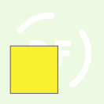

Géométrie surfacique :  
```
Remplissage simple
• couleur de remplissage : RVB 250,240,50 (#faf032)
• couleur de trait : RVB 102,102,102 (#666666)
• largeur de trait : 0.8 pt
• style de trait : ligne continue
```

Géométrie linéaire :  
*Pas de spécification.*

Géométrie ponctuelle :  
*Pas de spécification.*


### Prescription 04-00

**Périmètre issu des PDU sur obligation de stationnement**
            
- [x] Même symbole que pour les PLU.
- [ ] Apparaît dans la légende nationale PSMV.
        
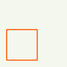

Géométrie surfacique :  
```
Remplissage simple
• couleur de trait : RVB 255,85,0 (#ff5500)
• largeur de trait : 1.5 pt
• style de remplissage : pas de remplissage
• style de trait : ligne continue
```

Géométrie linéaire :  
*Pas de spécification.*

Géométrie ponctuelle :  
*Pas de spécification.*


### Prescription 05-00

**Emplacement réservé (remarque : sauf lot de données antérieur au standard v2017, utiliser impérativement les sous-codes suivants)**
            
- [ ] Même symbole que pour les PLU.
- [x] Apparaît dans la légende nationale PSMV.
        
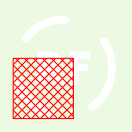

Géométrie surfacique :  
```
Motif de lignes
• espacement : 5 pt
• rotation : 135°

    Ligne simple
    • couleur : RVB 255,0,0 (#ff0000)
    • largeur de trait : 0.8 pt
    • style de cap : plat
    • style de jointure : angle droit
    • style de trait : ligne continue

Motif de lignes
• espacement : 5 pt
• rotation : 45°

    Ligne simple
    • couleur : RVB 255,0,0 (#ff0000)
    • largeur de trait : 0.8 pt
    • style de cap : plat
    • style de jointure : angle droit
    • style de trait : ligne continue

Ligne simple
• couleur : RVB 255,0,0 (#ff0000)
• largeur de trait : 0.8 pt
• style de trait : ligne continue
```

Géométrie linéaire :  
*Pas de spécification.*

Géométrie ponctuelle :  
*Pas de spécification.*


### Prescription 05-01

**Emplacement réservé aux voies publiques**

*Mêmes figurés que le sous-code [05-00](#prescription-05-00).*


### Prescription 05-02

**Emplacement réservé aux ouvrages publics**

*Mêmes figurés que le sous-code [05-00](#prescription-05-00).*


### Prescription 05-03

**Emplacement réservé aux installations d'intérêt général**

*Mêmes figurés que le sous-code [05-00](#prescription-05-00).*


### Prescription 05-04

**Emplacement réservé aux espaces verts / continuités écologiques**

*Mêmes figurés que le sous-code [05-00](#prescription-05-00).*


### Prescription 05-05

**Emplacement réservé logement social / mixité sociale**

*Mêmes figurés que le sous-code [05-00](#prescription-05-00).*


### Prescription 05-06

**Servitude de localisation des voies, ouvrages publics, installations d'intérêt général et espaces verts en zone U ou AU**

*Mêmes figurés que le sous-code [05-00](#prescription-05-00).*


### Prescription 05-07

**Secteur de projet en attente d'un projet d'aménagement global**
            
- [x] Même symbole que pour les PLU.
- [ ] Apparaît dans la légende nationale PSMV.
        


Géométrie surfacique :  
```
Motif de points
• distance horizontale : 12 pt
• distance verticale : 12 pt

    Symbole simple
    • couleur de trait : RVB 255,85,0 (#ff5500)
    • largeur de trait : 0.8 pt
    • nom du symbole : cross
    • style de trait : ligne continue
    • taille : 6 pt

Ligne simple
• couleur : RVB 255,85,0 (#ff5500)
• largeur de trait : 0.8 pt
• style de trait : ligne continue
```

Géométrie linéaire :  
*Pas de spécification.*

Géométrie ponctuelle :  
*Pas de spécification.*


### Prescription 07-00

**Patrimoine bâti, paysager ou éléments de paysage à protéger pour des motifs d'ordre culturel, historique, architectural ou écologique**
            
- [x] Même symbole que pour les PLU.
- [ ] Apparaît dans la légende nationale PSMV.
        
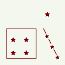

Géométrie surfacique :  
```
Motif de points
• distance horizontale : 20 pt
• distance verticale : 20 pt

    Symbole de police
    • caractère(s) : unicode 234
    • couleur de remplissage : RVB 255,255,255 (#ffffff)
    • famille de police : Wingdings 2
    • taille : 18 pt

    Symbole de police
    • caractère(s) : unicode 234
    • couleur de remplissage : RVB 115,0,0 (#730000)
    • famille de police : Wingdings 2
    • taille : 12 pt

Ligne simple
• couleur : RVB 115,0,0 (#730000)
• largeur de trait : 0.8 pt
• style de trait : ligne continue
```

Géométrie linéaire :  
```
Ligne de symboles
• décalage le long de la ligne : 13 pt
• intervalle : 18 pt

    Symbole de police
    • caractère(s) : unicode 234
    • couleur de remplissage : RVB 255,255,255 (#ffffff)
    • famille de police : Wingdings 2
    • taille : 16 pt

    Symbole de police
    • caractère(s) : unicode 234
    • couleur de remplissage : RVB 115,0,0 (#730000)
    • famille de police : Wingdings 2
    • taille : 10 pt

Ligne simple
• couleur : RVB 115,0,0 (#730000)
• largeur de trait : 1 pt
• style de trait : ligne continue
```

Géométrie ponctuelle :  
```
Symbole de police
• caractère(s) : unicode 234
• couleur de remplissage : RVB 255,255,255 (#ffffff)
• famille de police : Wingdings 2
• taille : 18 pt

Symbole de police
• caractère(s) : unicode 234
• couleur de remplissage : RVB 115,0,0 (#730000)
• famille de police : Wingdings 2
• taille : 12 pt
```


### Prescription 07-01

**Patrimoine bâti à protéger pour des motifs d'ordre culturel, historique, architectural**

*Mêmes figurés que le sous-code [07-00](#prescription-07-00).*


### Prescription 07-02

**Patrimoine paysager à protéger pour des motifs d'ordre culturel, historique, architectural**

*Mêmes figurés que le sous-code [07-00](#prescription-07-00).*


### Prescription 07-03

**Patrimoine paysager correspondant à un espace boisé à protéger pour des motifs d'ordre culturel, historique, architectural**

*Mêmes figurés que le sous-code [07-00](#prescription-07-00).*


### Prescription 07-04

**Éléments de paysage, (sites et secteurs) à préserver pour des motifs d'ordre écologique**
            
- [x] Même symbole que pour les PLU.
- [ ] Apparaît dans la légende nationale PSMV.
        
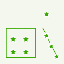

Géométrie surfacique :  
```
Motif de points
• distance horizontale : 20 pt
• distance verticale : 20 pt

    Symbole de police
    • caractère(s) : unicode 234
    • couleur de remplissage : RVB 255,255,255 (#ffffff)
    • famille de police : Wingdings 2
    • taille : 18 pt

    Symbole de police
    • caractère(s) : unicode 234
    • couleur de remplissage : RVB 56,168,0 (#38a800)
    • famille de police : Wingdings 2
    • taille : 12 pt

Ligne simple
• couleur : RVB 56,168,0 (#38a800)
• largeur de trait : 0.8 pt
• style de trait : ligne continue
```

Géométrie linéaire :  
```
Ligne de symboles
• décalage le long de la ligne : 13 pt
• intervalle : 18 pt

    Symbole de police
    • caractère(s) : unicode 234
    • couleur de remplissage : RVB 255,255,255 (#ffffff)
    • famille de police : Wingdings 2
    • taille : 16 pt

    Symbole de police
    • caractère(s) : unicode 234
    • couleur de remplissage : RVB 56,168,0 (#38a800)
    • famille de police : Wingdings 2
    • taille : 10 pt

Ligne simple
• couleur : RVB 56,168,0 (#38a800)
• largeur de trait : 1 pt
• style de trait : ligne continue
```

Géométrie ponctuelle :  
```
Symbole de police
• caractère(s) : unicode 234
• couleur de remplissage : RVB 255,255,255 (#ffffff)
• famille de police : Wingdings 2
• taille : 18 pt

Symbole de police
• caractère(s) : unicode 234
• couleur de remplissage : RVB 56,168,0 (#38a800)
• famille de police : Wingdings 2
• taille : 12 pt
```


### Prescription 07-05

**Éléments de paysage correspondant à un espace boisé, (sites et secteurs) à préserver pour des motifs d'ordre écologique**

*Mêmes figurés que le sous-code [07-04](#prescription-07-04).*


### Prescription 07-50

**Immeuble bâti dont les parties intérieures et extérieures sont protégées en totalité, à conserver, restaurer et mettre en valeur**
            
- [ ] Même symbole que pour les PLU.
- [x] Apparaît dans la légende nationale PSMV.
        
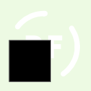

Géométrie surfacique :  
```
Remplissage simple
• couleur de remplissage : RVB 0,0,0 (#000000)
• couleur de trait : RVB 102,102,102 (#666666)
• largeur de trait : 0.8 pt
• style de trait : ligne continue
```

Géométrie linéaire :  
*Pas de spécification.*

Géométrie ponctuelle :  
*Pas de spécification.*


### Prescription 07-51

**Élément intérieur particulier protégé, à conserver, restaurer et mettre en valeur**
            
- [ ] Même symbole que pour les PLU.
- [x] Apparaît dans la légende nationale PSMV.
        
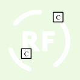

Géométrie surfacique :  
```
Remplissage de centroïde
• dessiner le point sur toutes les parties d'une entité multi-parties : oui
• forcer le point dans le polygone : oui

    Symbole de police
    • caractère(s) : [txt] (unicode 91)
    • couleur de remplissage : RVB 0,0,0 (#000000)
    • décalage (en x, en y) : 0,-1 pt
    • famille de police : Times New Roman
    • taille : 8 pt

    Symbole simple
    • couleur de remplissage : RVB 255,255,255 (#ffffff)
    • couleur de trait : RVB 0,0,0 (#000000)
    • largeur de trait : 1 pt
    • nom du symbole : square
    • style de trait : ligne continue
    • taille : [7 + 5 * length(txt)] pt
```

Géométrie linéaire :  
*Pas de spécification.*

Géométrie ponctuelle :  
```
Symbole de police
• caractère(s) : [txt] (unicode 91)
• couleur de remplissage : RVB 0,0,0 (#000000)
• décalage (en x, en y) : 0,-1 pt
• famille de police : Times New Roman
• taille : 8 pt

Symbole simple
• couleur de remplissage : RVB 255,255,255 (#ffffff)
• couleur de trait : RVB 0,0,0 (#000000)
• largeur de trait : 1 pt
• nom du symbole : square
• style de trait : ligne continue
• taille : [7 + 5 * length(txt)] pt
```


### Prescription 07-52

**Immeuble bâti dont les parties extérieures sont protégées (façades, toitures, etc.), à conserver, restaurer et mettre en valeur**
            
- [ ] Même symbole que pour les PLU.
- [x] Apparaît dans la légende nationale PSMV.
        
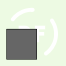

Géométrie surfacique :  
```
Remplissage simple
• couleur de remplissage : RVB 102,102,102 (#666666)
• couleur de trait : RVB 0,0,0 (#000000)
• largeur de trait : 0.8 pt
• style de trait : ligne continue
```

Géométrie linéaire :  
*Pas de spécification.*

Géométrie ponctuelle :  
*Pas de spécification.*


### Prescription 07-53

**Mur de soutènement, rempart ou mur de clôture protégé, à conserver, restaurer et mettre en valeur**
            
- [ ] Même symbole que pour les PLU.
- [x] Apparaît dans la légende nationale PSMV.
        


Géométrie surfacique :  
*Pas de spécification.*

Géométrie linéaire :  
```
Ligne simple
• couleur : RVB 0,0,0 (#000000)
• largeur de trait : 4.6 pt
• style de trait : ligne continue

Ligne simple
• couleur : RVB 102,102,102 (#666666)
• largeur de trait : 3 pt
• style de trait : ligne continue
```

Géométrie ponctuelle :  
*Pas de spécification.*


### Prescription 07-54

**Élément extérieur particulier protégé (portail, clôture, puits, fontaine, statue, décor, etc.), à conserver, restaurer et mettre en valeur**
            
- [ ] Même symbole que pour les PLU.
- [x] Apparaît dans la légende nationale PSMV.
        


Géométrie surfacique :  
*Pas de spécification.*

Géométrie linéaire :  
*Pas de spécification.*

Géométrie ponctuelle :  
```
Symbole de police
• caractère(s) : unicode 234
• couleur de remplissage : RVB 102,102,102 (#666666)
• famille de police : Wingdings 2
• taille : 18 pt

Symbole de police
• caractère(s) : unicode 234
• couleur de remplissage : RVB 255,255,255 (#ffffff)
• famille de police : Wingdings 2
• taille : 12 pt
```


### Prescription 07-55

**Séquence, composition, ordonnance architecturale ou urbaine protégée, à conserver, restaurer et mettre en valeur**
            
- [ ] Même symbole que pour les PLU.
- [x] Apparaît dans la légende nationale PSMV.
        


Géométrie surfacique :  
*Pas de spécification.*

Géométrie linéaire :  
```
Ligne de symboles
• intervalle : 6 pt

    Symbole simple
    • couleur de remplissage : RVB 102,102,102 (#666666)
    • nom du symbole : equilateral_triangle
    • taille : 8 pt
```

Géométrie ponctuelle :  
*Pas de spécification.*


### Prescription 07-56

**Séquence naturelle protégée (front rocheux, falaise, etc.), à conserver, restaurer et mettre en valeur**
            
- [ ] Même symbole que pour les PLU.
- [x] Apparaît dans la légende nationale PSMV.
        


Géométrie surfacique :  
*Pas de spécification.*

Géométrie linéaire :  
```
Ligne de symboles
• intervalle : 6 pt

    Symbole simple
    • couleur de remplissage : RVB 90,140,40 (#5a8c28)
    • nom du symbole : equilateral_triangle
    • taille : 8 pt
```

Géométrie ponctuelle :  
*Pas de spécification.*


### Prescription 07-57

**Parc ou jardin de pleine terre protégé, à conserver, restaurer et mettre en valeur**
            
- [ ] Même symbole que pour les PLU.
- [x] Apparaît dans la légende nationale PSMV.
        
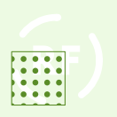

Géométrie surfacique :  
```
Motif de points
• distance horizontale : 10 pt
• distance verticale : 10 pt

    Symbole simple
    • couleur de remplissage : RVB 90,140,40 (#5a8c28)
    • nom du symbole : circle
    • taille : 5 pt

Ligne simple
• couleur : RVB 90,140,40 (#5a8c28)
• largeur de trait : 0.8 pt
• style de trait : ligne continue
```

Géométrie linéaire :  
*Pas de spécification.*

Géométrie ponctuelle :  
*Pas de spécification.*


### Prescription 07-58

**Espace libre à dominante végétale protégé, à conserver, restaurer et mettre en valeur**
            
- [ ] Même symbole que pour les PLU.
- [x] Apparaît dans la légende nationale PSMV.
        
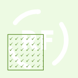

Géométrie surfacique :  
```
Motif de points
• distance horizontale : 7 pt
• distance verticale : 7 pt

    Symbole de police
    • caractère(s) : unicode 252
    • couleur de remplissage : RVB 90,140,40 (#5a8c28)
    • famille de police : Wingdings
    • taille : 6 pt

Ligne simple
• couleur : RVB 90,140,40 (#5a8c28)
• largeur de trait : 0.8 pt
• style de trait : ligne continue
```

Géométrie linéaire :  
*Pas de spécification.*

Géométrie ponctuelle :  
*Pas de spécification.*


### Prescription 07-59

**Séquence, composition ou ordonnance végétale d’ensemble protégée, à conserver, restaurer et mettre en valeur**
            
- [ ] Même symbole que pour les PLU.
- [x] Apparaît dans la légende nationale PSMV.
        


Géométrie surfacique :  
*Pas de spécification.*

Géométrie linéaire :  
```
Ligne de symboles
• intervalle : 6 pt

    Symbole simple
    • couleur de remplissage : RVB 90,140,40 (#5a8c28)
    • nom du symbole : circle
    • taille : 6 pt
```

Géométrie ponctuelle :  
*Pas de spécification.*


### Prescription 07-60

**Arbre remarquable ou autre élément naturel protégé (grotte, rocher, etc.), à conserver, restaurer et mettre en valeur**
            
- [ ] Même symbole que pour les PLU.
- [x] Apparaît dans la légende nationale PSMV.
        


Géométrie surfacique :  
*Pas de spécification.*

Géométrie linéaire :  
*Pas de spécification.*

Géométrie ponctuelle :  
```
Symbole simple
• couleur de remplissage : RVB 90,140,40 (#5a8c28)
• nom du symbole : circle
• taille : 11 pt
```


### Prescription 07-61

**Place, cour ou autre espace libre à dominante minérale protégé (pavés, calades, etc.), à conserver, restaurer et mettre en valeur**
            
- [ ] Même symbole que pour les PLU.
- [x] Apparaît dans la légende nationale PSMV.
        
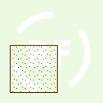

Géométrie surfacique :  
```
Motif de points
• déplacement horizontal : 1.5 pt
• déplacement vertical : 3 pt
• distance horizontale : 4 pt
• distance verticale : 4 pt

    Symbole de police
    • caractère(s) : l (unicode 108)
    • couleur de remplissage : RVB 100,50,0 (#643200)
    • famille de police : Wingdings
    • taille : 1 pt

Ligne simple
• couleur : RVB 100,50,0 (#643200)
• largeur de trait : 0.8 pt
• style de trait : ligne continue
```

Géométrie linéaire :  
*Pas de spécification.*

Géométrie ponctuelle :  
*Pas de spécification.*


### Prescription 07-62

**Cours d'eau, réseau hydraulique ou étendue aquatique protégé, à conserver, restaurer et mettre en valeur**
            
- [ ] Même symbole que pour les PLU.
- [x] Apparaît dans la légende nationale PSMV.
        
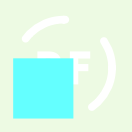

Géométrie surfacique :  
```
Remplissage simple
• couleur de remplissage : RVB 100,255,255 (#64ffff)
• style de trait : pas de ligne
```

Géométrie linéaire :  
*Pas de spécification.*

Géométrie ponctuelle :  
*Pas de spécification.*


### Prescription 07-63

**Point d'eau ou source protégé, à conserver, restaurer et mettre en valeur**
            
- [ ] Même symbole que pour les PLU.
- [x] Apparaît dans la légende nationale PSMV.
        


Géométrie surfacique :  
*Pas de spécification.*

Géométrie linéaire :  
*Pas de spécification.*

Géométrie ponctuelle :  
```
Symbole simple
• couleur de remplissage : RVB 100,255,255 (#64ffff)
• nom du symbole : circle
• taille : 11 pt
```


### Prescription 07-64

**Passage d'eau souterrain protégé, à conserver, restaurer et mettre en valeur**
            
- [ ] Même symbole que pour les PLU.
- [x] Apparaît dans la légende nationale PSMV.
        
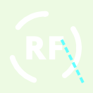

Géométrie surfacique :  
*Pas de spécification.*

Géométrie linéaire :  
```
Ligne simple
• couleur : RVB 100,255,255 (#64ffff)
• largeur de trait : 3 pt
• style de trait : ligne en pointillé
```

Géométrie ponctuelle :  
*Pas de spécification.*


### Prescription 07-65

**Espace vert non protégé à requalifier**
            
- [ ] Même symbole que pour les PLU.
- [x] Apparaît dans la légende nationale PSMV.
        
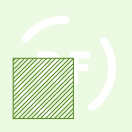

Géométrie surfacique :  
```
Motif de lignes
• décalage : 2 pt
• espacement : 5 pt
• rotation : 45°

    Ligne simple
    • couleur : RVB 90,140,40 (#5a8c28)
    • largeur de trait : 0.8 pt
    • style de trait : ligne continue

Motif de lignes
• espacement : 5 pt
• rotation : 45°

    Ligne simple
    • couleur : RVB 90,140,40 (#5a8c28)
    • largeur de trait : 0.8 pt
    • style de trait : ligne continue

Ligne simple
• couleur : RVB 90,140,40 (#5a8c28)
• largeur de trait : 0.8 pt
• style de trait : ligne continue
```

Géométrie linéaire :  
*Pas de spécification.*

Géométrie ponctuelle :  
*Pas de spécification.*


### Prescription 07-66

**Place, cour, ou autre espace libre à dominante minérale non protégé à requalifier**
            
- [ ] Même symbole que pour les PLU.
- [x] Apparaît dans la légende nationale PSMV.
        
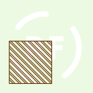

Géométrie surfacique :  
```
Motif de lignes
• décalage : 2 pt
• espacement : 5 pt
• rotation : 135°

    Ligne simple
    • couleur : RVB 100,50,0 (#643200)
    • largeur de trait : 0.8 pt
    • style de trait : ligne continue

Motif de lignes
• espacement : 5 pt
• rotation : 135°

    Ligne simple
    • couleur : RVB 100,50,0 (#643200)
    • largeur de trait : 0.8 pt
    • style de trait : ligne continue

Ligne simple
• couleur : RVB 100,50,0 (#643200)
• largeur de trait : 0.8 pt
• style de trait : ligne continue
```

Géométrie linéaire :  
*Pas de spécification.*

Géométrie ponctuelle :  
*Pas de spécification.*


### Prescription 07-67

**Immeuble bâti non protégé soumis à des dispositions spécifiques ou des règles générales localisées**
            
- [ ] Même symbole que pour les PLU.
- [x] Apparaît dans la légende nationale PSMV.
        
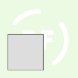

Géométrie surfacique :  
```
Remplissage simple
• couleur de remplissage : RVB 221,221,221 (#dddddd)
• couleur de trait : RVB 102,102,102 (#666666)
• largeur de trait : 0.8 pt
• style de trait : ligne continue
```

Géométrie linéaire :  
*Pas de spécification.*

Géométrie ponctuelle :  
*Pas de spécification.*


### Prescription 07-68

**Immeuble non bâti ou espace libre non protégé soumis à des dispositions spécifiques ou des règles générales localisées**
            
- [ ] Même symbole que pour les PLU.
- [x] Apparaît dans la légende nationale PSMV.
        
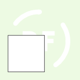

Géométrie surfacique :  
```
Remplissage simple
• couleur de remplissage : RVB 255,255,255 (#ffffff)
• couleur de trait : RVB 102,102,102 (#666666)
• largeur de trait : 0.8 pt
• style de trait : ligne continue
```

Géométrie linéaire :  
*Pas de spécification.*

Géométrie ponctuelle :  
*Pas de spécification.*


### Prescription 07-69

**Unité urbanistique ou paysagère (secteur, quartier...) soumise à des dispositions spécifiques**
            
- [ ] Même symbole que pour les PLU.
- [ ] Apparaît dans la légende nationale PSMV.
        
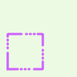

Géométrie surfacique :  
```
Ligne simple
• couleur : RVB 205,100,255 (#cd64ff)
• largeur de trait : 3 pt
• modèle de tiret personnalisé (tiret ; espace) : [21;6;1;4;1;4;1;4] pt
• style de cap : rond
```

Géométrie linéaire :  
*Pas de spécification.*

Géométrie ponctuelle :  
*Pas de spécification.*


### Prescription 08-00

**Terrain cultivé ou non bâti à protéger en zone urbaine**
            
- [x] Même symbole que pour les PLU.
- [ ] Apparaît dans la légende nationale PSMV.
        


Géométrie surfacique :  
```
Motif de points
• distance horizontale : 17 pt
• distance verticale : 17 pt

    Symbole de police
    • caractère(s) : unicode 252
    • couleur de remplissage : RVB 45,104,55 (#2d6837)
    • famille de police : Wingdings
    • taille : 13 pt

Ligne simple
• couleur : RVB 45,104,55 (#2d6837)
• largeur de trait : 0.8 pt
• style de trait : ligne continue
```

Géométrie linéaire :  
*Pas de spécification.*

Géométrie ponctuelle :  
*Pas de spécification.*


### Prescription 13-00

**Zone à aménager en vue de la pratique du ski**
            
- [x] Même symbole que pour les PLU.
- [ ] Apparaît dans la légende nationale PSMV.
        


Géométrie surfacique :  
```
Motif de points
• distance horizontale : 10 pt
• distance verticale : 10 pt

    Symbole simple
    • couleur de remplissage : RVB 178,178,178 (#b2b2b2)
    • nom du symbole : square
    • taille : 5 pt

Ligne simple
• couleur : RVB 178,178,178 (#b2b2b2)
• largeur de trait : 0.8 pt
• style de trait : ligne continue
```

Géométrie linéaire :  
*Pas de spécification.*

Géométrie ponctuelle :  
*Pas de spécification.*


### Prescription 14-00

**Secteur de plan de masse**
            
- [x] Même symbole que pour les PLU.
- [ ] Apparaît dans la légende nationale PSMV.
        
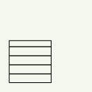

Géométrie surfacique :  
```
Motif de lignes
• espacement : 10 pt

    Ligne simple
    • couleur : RVB 0,0,0 (#000000)
    • largeur de trait : 1 pt
    • style de trait : ligne continue

Ligne simple
• couleur : RVB 0,0,0 (#000000)
• largeur de trait : 0.8 pt
• style de trait : ligne continue
```

Géométrie linéaire :  
*Pas de spécification.*

Géométrie ponctuelle :  
*Pas de spécification.*


### Prescription 15-00

**Règles d'implantation des constructions**
            
- [x] Même symbole que pour les PLU.
- [ ] Apparaît dans la légende nationale PSMV.
        
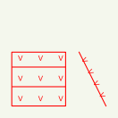

Géométrie surfacique :  
```
Motif de lignes
• espacement : 17 pt

    Ligne simple
    • couleur : RVB 255,0,0 (#ff0000)
    • largeur de trait : 0.8 pt
    • style de trait : ligne continue

Motif de points
• distance horizontale : 17 pt
• distance verticale : 17 pt

    Symbole de police
    • caractère(s) : V (unicode 86)
    • couleur de remplissage : RVB 255,0,0 (#ff0000)
    • famille de police : Arial
    • point d'ancrage vertical : en dessous
    • taille : 6 pt

Ligne simple
• couleur : RVB 255,0,0 (#ff0000)
• largeur de trait : 0.8 pt
• style de trait : ligne continue
```

Géométrie linéaire :  
```
Ligne de symboles
• décalage de la ligne : -2 pt
• décalage le long de la ligne : 8 pt
• intervalle : 11 pt

    Symbole de police
    • caractère(s) : V (unicode 86)
    • couleur de remplissage : RVB 255,0,0 (#ff0000)
    • famille de police : Arial
    • style de jointure : angle droit
    • taille : 6 pt

Ligne simple
• couleur : RVB 255,0,0 (#ff0000)
• largeur de trait : 0.8 pt
• style de trait : ligne continue
```

Géométrie ponctuelle :  
*Pas de spécification.*


### Prescription 15-01

**Implantation des constructions par rapport aux voies et aux emprises publiques**

*Mêmes figurés que le sous-code [15-00](#prescription-15-00).*


### Prescription 15-02

**Implantation des constructions par rapport aux limites séparatives latérales**

*Mêmes figurés que le sous-code [15-00](#prescription-15-00).*


### Prescription 15-03

**Implantation des constructions par rapport aux limites des fonds de parcelles**

*Mêmes figurés que le sous-code [15-00](#prescription-15-00).*


### Prescription 15-50

**Limite maximale d'implantation de construction**
            
- [ ] Même symbole que pour les PLU.
- [x] Apparaît dans la légende nationale PSMV.
        
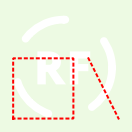

Géométrie surfacique :  
```
Ligne simple
• couleur : RVB 255,0,0 (#ff0000)
• largeur de trait : 1.5 pt
• style de trait : ligne en pointillé
```

Géométrie linéaire :  
```
Ligne simple
• couleur : RVB 255,0,0 (#ff0000)
• largeur de trait : 1.5 pt
• style de trait : ligne en pointillé
```

Géométrie ponctuelle :  
*Pas de spécification.*


### Prescription 15-51

**Limite imposée d'implantation de construction**
            
- [ ] Même symbole que pour les PLU.
- [x] Apparaît dans la légende nationale PSMV.
        
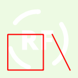

Géométrie surfacique :  
```
Ligne simple
• couleur : RVB 255,0,0 (#ff0000)
• largeur de trait : 1.5 pt
• style de trait : ligne continue
```

Géométrie linéaire :  
```
Ligne simple
• couleur : RVB 255,0,0 (#ff0000)
• largeur de trait : 1.5 pt
• style de trait : ligne continue
```

Géométrie ponctuelle :  
*Pas de spécification.*


### Prescription 15-98

**Implantation alternative des constructions**

*Mêmes figurés que le sous-code [15-00](#prescription-15-00).*


### Prescription 16-00

**Constructions et installations nécessaires à des équipements collectifs**
            
- [x] Même symbole que pour les PLU.
- [ ] Apparaît dans la légende nationale PSMV.
        


Géométrie surfacique :  
```
Motif de points
• distance horizontale : 15 pt
• distance verticale : 15 pt

    Symbole de police
    • caractère(s) : unicode 158
    • couleur de remplissage : RVB 230,195,0 (#e6c300)
    • famille de police : Wingdings 2
    • taille : 10 pt

Ligne simple
• couleur : RVB 230,195,0 (#e6c300)
• largeur de trait : 0.8 pt
• style de trait : ligne continue
```

Géométrie linéaire :  
*Pas de spécification.*

Géométrie ponctuelle :  
```
Symbole de police
• caractère(s) : unicode 158
• couleur de remplissage : RVB 230,195,0 (#e6c300)
• famille de police : Wingdings 2
• taille : 10 pt
```


### Prescription 16-01

**Bâtiment susceptible de changer de destination**

*Mêmes figurés que le sous-code [16-00](#prescription-16-00).*


### Prescription 16-02

**Bâtiments d'habitation existants pouvant faire l'objet d'extensions ou d'annexes**

*Mêmes figurés que le sous-code [16-00](#prescription-16-00).*


### Prescription 16-03

**Secteur de taille et de capacité d'accueil limitées (STECAL)**
            
- [x] Même symbole que pour les PLU.
- [ ] Apparaît dans la légende nationale PSMV.
        
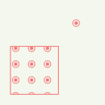

Géométrie surfacique :  
```
Motif de points
• distance horizontale : 15 pt
• distance verticale : 15 pt

    Symbole de police
    • caractère(s) : unicode 158
    • couleur de remplissage : RVB 245,122,122 (#f57a7a)
    • famille de police : Wingdings 2
    • taille : 10 pt

Ligne simple
• couleur : RVB 245,122,122 (#f57a7a)
• largeur de trait : 0.8 pt
• style de trait : ligne continue
```

Géométrie linéaire :  
*Pas de spécification.*

Géométrie ponctuelle :  
```
Symbole de police
• caractère(s) : unicode 158
• couleur de remplissage : RVB 245,122,122 (#f57a7a)
• famille de police : Wingdings 2
• taille : 10 pt
```


### Prescription 16-04

**Constructions et installations nécessaires à l'activité agricole en zone A ou N**

*Mêmes figurés que le sous-code [16-00](#prescription-16-00).*


### Prescription 16-05

**Diversification de l'activité agricole : transformation, conditionnement et ventes de produits agricoles (activités liées au tourisme exclues)**

*Mêmes figurés que le sous-code [16-00](#prescription-16-00).*


### Prescription 17-00

**Secteur à programme de logements mixité sociale en Zone U et AU**
            
- [x] Même symbole que pour les PLU.
- [ ] Apparaît dans la légende nationale PSMV.
        
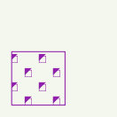

Géométrie surfacique :  
```
Motif de points
• déplacement horizontal : 12 pt
• distance horizontale : 24 pt
• distance verticale : 12 pt

    Symbole de police
    • caractère(s) : z (unicode 122)
    • couleur de remplissage : RVB 143,33,170 (#8f21aa)
    • famille de police : Wingdings 3
    • taille : 8 pt

    Symbole de police
    • caractère(s) : c (unicode 99)
    • couleur de remplissage : RVB 143,33,170 (#8f21aa)
    • famille de police : Webdings
    • taille : 6 pt

Ligne simple
• couleur : RVB 143,33,170 (#8f21aa)
• largeur de trait : 0.8 pt
• style de trait : ligne continue
```

Géométrie linéaire :  
*Pas de spécification.*

Géométrie ponctuelle :  
*Pas de spécification.*


### Prescription 18-00

**Secteur comportant des orientations d'aménagement et de programmation (OAP)**
            
- [ ] Même symbole que pour les PLU.
- [x] Apparaît dans la légende nationale PSMV.
        
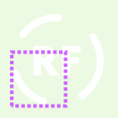

Géométrie surfacique :  
```
Ligne simple
• couleur : RVB 205,100,255 (#cd64ff)
• largeur de trait : 3 pt
• modèle de tiret personnalisé (tiret ; espace) : [3;2;3;2;3;2] pt
• style de cap : plat
• style de jointure : angle droit
```

Géométrie linéaire :  
*Pas de spécification.*

Géométrie ponctuelle :  
*Pas de spécification.*


### Prescription 18-01

**OAP de projet (sans règlement)**

*Mêmes figurés que le sous-code [18-00](#prescription-18-00).*


### Prescription 18-02

**OAP entrées de ville**

*Mêmes figurés que le sous-code [18-00](#prescription-18-00).*


### Prescription 18-03

**OAP relatives à la réhabilitation, la restructuration, la mise en valeur ou l'aménagement**

*Mêmes figurés que le sous-code [18-00](#prescription-18-00).*


### Prescription 18-04

**OAP d'adaptation des périmètres de transports collectifs**

*Mêmes figurés que le sous-code [18-00](#prescription-18-00).*


### Prescription 18-05

**OAP patrimoniales, architecturales et écologiques**

*Mêmes figurés que le sous-code [18-00](#prescription-18-00).*


### Prescription 18-06

**OAP relatives à l'habitat**

*Mêmes figurés que le sous-code [18-00](#prescription-18-00).*


### Prescription 18-07

**OAP comprenant des dispositions relatives à l'équipement commercial et artisanal**

*Mêmes figurés que le sous-code [18-00](#prescription-18-00).*


### Prescription 18-08

**OAP relatives aux transports et aux déplacements**

*Mêmes figurés que le sous-code [18-00](#prescription-18-00).*


### Prescription 18-09

**OAP relatives aux espaces publics en zone d'aménagement concerté**

*Mêmes figurés que le sous-code [18-00](#prescription-18-00).*


### Prescription 18-10

**OAP relatives aux ouvrages publics, installations d'intérêt général et espaces verts en zone d'aménagement concerté**

*Mêmes figurés que le sous-code [18-00](#prescription-18-00).*


### Prescription 18-11

**OAP valant création de zone d'aménagement concerté**

*Mêmes figurés que le sous-code [18-00](#prescription-18-00).*


### Prescription 19-00

**Secteur protégé en raison de la richesse du sol et du sous-sol**
            
- [x] Même symbole que pour les PLU.
- [ ] Apparaît dans la légende nationale PSMV.
        
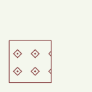

Géométrie surfacique :  
```
Motif de points
• distance horizontale : 19 pt
• distance verticale : 19 pt

    Symbole de police
    • caractère(s) : unicode 176
    • couleur de remplissage : RVB 137,68,68 (#894444)
    • famille de police : Wingdings 2
    • taille : 12 pt

Ligne simple
• couleur : RVB 137,68,68 (#894444)
• largeur de trait : 0.8 pt
• style de trait : ligne continue
```

Géométrie linéaire :  
*Pas de spécification.*

Géométrie ponctuelle :  
*Pas de spécification.*


### Prescription 20-00

**Secteur à transfert de constructibilité en zone N**
            
- [x] Même symbole que pour les PLU.
- [ ] Apparaît dans la légende nationale PSMV.
        
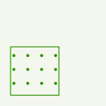

Géométrie surfacique :  
```
Motif de points
• distance horizontale : 13 pt
• distance verticale : 13 pt

    Symbole simple
    • couleur de remplissage : RVB 38,140,0 (#268c00)
    • couleur de trait : RVB 38,140,0 (#268c00)
    • largeur de trait : 0.8 pt
    • nom du symbole : circle
    • style de trait : ligne continue
    • taille : 2 pt

Ligne simple
• couleur : RVB 38,140,0 (#268c00)
• largeur de trait : 0.8 pt
• style de trait : ligne continue
```

Géométrie linéaire :  
*Pas de spécification.*

Géométrie ponctuelle :  
*Pas de spécification.*


### Prescription 22-00

**Diversité commerciale à protéger ou à développer**
            
- [x] Même symbole que pour les PLU.
- [ ] Apparaît dans la légende nationale PSMV.
        
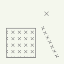

Géométrie surfacique :  
```
Motif de points
• distance horizontale : 10 pt
• distance verticale : 10 pt

    Symbole simple
    • couleur de trait : RVB 130,130,130 (#828282)
    • largeur de trait : 0.8 pt
    • nom du symbole : cross2
    • style de trait : ligne continue
    • taille : 4 pt

Ligne simple
• couleur : RVB 130,130,130 (#828282)
• largeur de trait : 0.8 pt
• style de trait : ligne continue
```

Géométrie linéaire :  
```
Ligne de symboles
• intervalle : 8 pt

    Symbole simple
    • couleur de trait : RVB 130,130,130 (#828282)
    • largeur de trait : 0.8 pt
    • nom du symbole : cross2
    • style de jointure : angle droit
    • style de trait : ligne continue
    • taille : 4 pt
```

Géométrie ponctuelle :  
```
Symbole simple
• couleur de trait : RVB 130,130,130 (#828282)
• largeur de trait : 0.8 pt
• nom du symbole : cross2
• style de trait : ligne continue
• taille : 6 pt
```


### Prescription 22-01

**Diversité commerciale à protéger**

*Mêmes figurés que le sous-code [22-00](#prescription-22-00).*


### Prescription 22-02

**Diversité commerciale à développer**

*Mêmes figurés que le sous-code [22-00](#prescription-22-00).*


### Prescription 22-03

**Linéaire commercial protégé**

*Mêmes figurés que le sous-code [22-00](#prescription-22-00).*


### Prescription 22-04

**Linéaire commercial protégé renforcé**

*Mêmes figurés que le sous-code [22-00](#prescription-22-00).*


### Prescription 23-00

**Secteur avec taille minimale des logements en zone U et AU**
            
- [x] Même symbole que pour les PLU.
- [ ] Apparaît dans la légende nationale PSMV.
        
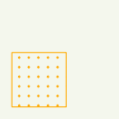

Géométrie surfacique :  
```
Motif de points
• distance horizontale : 8 pt
• distance verticale : 8 pt

    Symbole simple
    • couleur de remplissage : RVB 255,170,0 (#ffaa00)
    • nom du symbole : circle
    • taille : 1.5 pt

Ligne simple
• couleur : RVB 255,170,0 (#ffaa00)
• largeur de trait : 0.8 pt
• style de trait : ligne continue
```

Géométrie linéaire :  
*Pas de spécification.*

Géométrie ponctuelle :  
*Pas de spécification.*


### Prescription 24-00

**Voies, chemins, transport public à conserver et à créer**
            
- [x] Même symbole que pour les PLU.
- [ ] Apparaît dans la légende nationale PSMV.
        
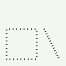

Géométrie surfacique :  
```
Ligne hachurée
• intervalle : 5.5 pt
• longueur de hachure : 2.5 pt

    Ligne simple
    • couleur : RVB 0,0,0 (#000000)
    • largeur de trait : 1 pt
    • style de cap : plat
    • style de jointure : angle droit
    • style de trait : ligne continue
```

Géométrie linéaire :  
```
Ligne hachurée
• intervalle : 4 pt
• longueur de hachure : 2.5 pt

    Ligne simple
    • couleur : RVB 0,0,0 (#000000)
    • largeur de trait : 1 pt
    • style de cap : plat
    • style de jointure : angle droit
    • style de trait : ligne continue
```

Géométrie ponctuelle :  
*Pas de spécification.*


### Prescription 24-01

**Voies de circulation à créer, modifier ou conserver**

*Mêmes figurés que le sous-code [24-00](#prescription-24-00).*


### Prescription 24-02

**Voies de circulation à modifier**

*Mêmes figurés que le sous-code [24-00](#prescription-24-00).*


### Prescription 24-03

**Voies de circulation à créer**

*Mêmes figurés que le sous-code [24-00](#prescription-24-00).*


### Prescription 24-04

**Voies de circulation à conserver**

*Mêmes figurés que le sous-code [24-00](#prescription-24-00).*


### Prescription 24-50

**Passage ou liaison piétonne à maintenir ou à créer**
            
- [ ] Même symbole que pour les PLU.
- [x] Apparaît dans la légende nationale PSMV.
        


Géométrie surfacique :  
*Pas de spécification.*

Géométrie linéaire :  
```
Ligne de symboles
• intervalle : 13.5 pt

    Symbole de police
    • caractère(s) : unicode 134
    • couleur de remplissage : RVB 255,0,0 (#ff0000)
    • décalage (en x, en y) : 6,0 pt
    • famille de police : Wingdings 3
    • taille : 10 pt

    Symbole de police
    • caractère(s) : unicode 133
    • couleur de remplissage : RVB 255,0,0 (#ff0000)
    • famille de police : Wingdings 3
    • taille : 10 pt
```

Géométrie ponctuelle :  
*Pas de spécification.*


### Prescription 25-00

**Éléments de continuité écologique et trame verte et bleue**
            
- [x] Même symbole que pour les PLU.
- [ ] Apparaît dans la légende nationale PSMV.
        
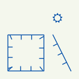

Géométrie surfacique :  
```
Ligne hachurée
• décalage de la ligne : 3 pt
• intervalle : 13 pt
• longueur de hachure : 6 pt

    Ligne simple
    • couleur : RVB 0,77,168 (#004da8)
    • largeur de trait : 1 pt
    • style de cap : plat
    • style de jointure : angle droit
    • style de trait : ligne continue

Ligne simple
• couleur : RVB 0,77,168 (#004da8)
• largeur de trait : 1 pt
• style de trait : ligne continue
```

Géométrie linéaire :  
```
Ligne hachurée
• décalage de la ligne : 3 pt
• décalage le long de la ligne : 12.5 pt
• intervalle : 13 pt
• longueur de hachure : 6 pt

    Ligne simple
    • couleur : RVB 0,77,168 (#004da8)
    • largeur de trait : 1 pt
    • style de cap : plat
    • style de jointure : angle droit
    • style de trait : ligne continue

Ligne simple
• couleur : RVB 0,77,168 (#004da8)
• largeur de trait : 1 pt
• style de trait : ligne continue
```

Géométrie ponctuelle :  
```
Symbole de police
• caractère(s) : R (unicode 82)
• couleur de remplissage : RVB 0,77,168 (#004da8)
• famille de police : Wingdings
• taille : 18 pt
```


### Prescription 26-00

**Secteur de performance énergétique**
            
- [x] Même symbole que pour les PLU.
- [ ] Apparaît dans la légende nationale PSMV.
        
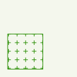

Géométrie surfacique :  
```
Motif de points
• distance horizontale : 11 pt
• distance verticale : 11 pt

    Symbole simple
    • couleur de trait : RVB 38,140,0 (#268c00)
    • largeur de trait : 0.8 pt
    • nom du symbole : cross
    • style de trait : ligne continue
    • taille : 5 pt

Ligne simple
• couleur : RVB 38,140,0 (#268c00)
• largeur de trait : 0.8 pt
• style de trait : ligne continue
```

Géométrie linéaire :  
*Pas de spécification.*

Géométrie ponctuelle :  
*Pas de spécification.*


### Prescription 26-01

**Secteur de performance énergétique renforcé**

*Mêmes figurés que le sous-code [26-00](#prescription-26-00).*


### Prescription 27-00

**Secteur d'aménagement numérique**
            
- [x] Même symbole que pour les PLU.
- [ ] Apparaît dans la légende nationale PSMV.
        
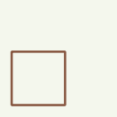

Géométrie surfacique :  
```
Ligne simple
• couleur : RVB 137,90,68 (#895a44)
• largeur de trait : 2 pt
• style de trait : ligne continue
```

Géométrie linéaire :  
*Pas de spécification.*

Géométrie ponctuelle :  
*Pas de spécification.*


### Prescription 28-00

**Conditions de desserte**
            
- [x] Même symbole que pour les PLU.
- [ ] Apparaît dans la légende nationale PSMV.
        
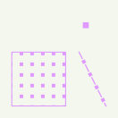

Géométrie surfacique :  
```
Motif de points
• distance horizontale : 9 pt
• distance verticale : 9 pt

    Symbole simple
    • couleur de remplissage : RVB 223,153,255 (#df99ff)
    • nom du symbole : square
    • taille : 3 pt

Ligne simple
• couleur : RVB 223,153,255 (#df99ff)
• largeur de trait : 0.8 pt
• style de trait : ligne continue
```

Géométrie linéaire :  
```
Ligne de symboles
• décalage le long de la ligne : 9 pt
• intervalle : 12 pt

    Symbole simple
    • couleur de remplissage : RVB 223,153,255 (#df99ff)
    • nom du symbole : square
    • taille : 3 pt

Ligne simple
• couleur : RVB 223,153,255 (#df99ff)
• largeur de trait : 1 pt
• modèle de tiret personnalisé (tiret ; espace) : 6;6 pt
```

Géométrie ponctuelle :  
```
Symbole simple
• couleur de remplissage : RVB 223,153,255 (#df99ff)
• nom du symbole : square
• taille : 5 pt
```


### Prescription 28-01

**Conditions permettant une bonne desserte des terrains par les services publics de collecte des déchets**

*Mêmes figurés que le sous-code [28-00](#prescription-28-00).*


### Prescription 29-00

**Secteur avec densité minimale de construction**
            
- [x] Même symbole que pour les PLU.
- [ ] Apparaît dans la légende nationale PSMV.
        
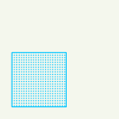

Géométrie surfacique :  
```
Motif de points
• distance horizontale : 2 pt
• distance verticale : 2 pt

    Symbole simple
    • couleur de remplissage : RVB 0,197,255 (#00c5ff)
    • nom du symbole : circle
    • taille : 1 pt

Ligne simple
• couleur : RVB 0,197,255 (#00c5ff)
• largeur de trait : 0.8 pt
• style de trait : ligne continue
```

Géométrie linéaire :  
*Pas de spécification.*

Géométrie ponctuelle :  
*Pas de spécification.*


### Prescription 29-01

**Secteur avec densité minimale de construction à proximité des tranxsports collectifs**

*Mêmes figurés que le sous-code [29-00](#prescription-29-00).*


### Prescription 30-00

**Majoration des volumes constructibles**
            
- [x] Même symbole que pour les PLU.
- [ ] Apparaît dans la légende nationale PSMV.
        
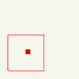

Géométrie surfacique :  
```
Motif de points
• décalage horizontal : 5 pt
• décalage vertical : 5 pt
• distance horizontale : 30 pt
• distance verticale : 30 pt

    Symbole simple
    • couleur de remplissage : RVB 230,0,0 (#e60000)
    • nom du symbole : square
    • taille : 6 pt

Ligne simple
• couleur : RVB 230,0,0 (#e60000)
• largeur de trait : 0.8 pt
• style de trait : ligne continue
```

Géométrie linéaire :  
*Pas de spécification.*

Géométrie ponctuelle :  
*Pas de spécification.*


### Prescription 30-01

**Majoration des volumes constructibles pour l'habitation**

*Mêmes figurés que le sous-code [30-00](#prescription-30-00).*


### Prescription 30-02

**Majoration des volumes constructibles pour les programmes comportant des logements locatifs sociaux**

*Mêmes figurés que le sous-code [30-00](#prescription-30-00).*


### Prescription 30-03

**Majoration des volumes constructibles pour exemplarité énergétique ou environnementale**

*Mêmes figurés que le sous-code [30-00](#prescription-30-00).*


### Prescription 30-04

**Majoration des volumes constructibles pour les programmes comportant des logements intermédiaires**

*Mêmes figurés que le sous-code [30-00](#prescription-30-00).*


### Prescription 31-00

**Espaces remarquables du littoral**
            
- [x] Même symbole que pour les PLU.
- [ ] Apparaît dans la légende nationale PSMV.
        
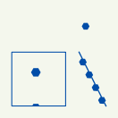

Géométrie surfacique :  
```
Motif de points
• distance horizontale : 30 pt
• distance verticale : 30 pt

    Symbole de police
    • caractère(s) : unicode 194
    • couleur de remplissage : RVB 0,77,168 (#004da8)
    • famille de police : Wingdings 2
    • taille : 11 pt

Ligne simple
• couleur : RVB 0,77,168 (#004da8)
• largeur de trait : 0.8 pt
• style de trait : ligne continue
```

Géométrie linéaire :  
```
Ligne de symboles
• décalage le long de la ligne : 9 pt
• intervalle : 12 pt

    Symbole de police
    • caractère(s) : unicode 194
    • couleur de remplissage : RVB 0,77,168 (#004da8)
    • famille de police : Wingdings 2
    • taille : 9 pt

Ligne simple
• couleur : RVB 0,77,168 (#004da8)
• largeur de trait : 1 pt
• modèle de tiret personnalisé (tiret ; espace) : 6;6 pt
```

Géométrie ponctuelle :  
```
Symbole de police
• caractère(s) : unicode 194
• couleur de remplissage : RVB 0,77,168 (#004da8)
• famille de police : Wingdings 2
• taille : 9 pt
```


### Prescription 31-01

**Dunes, landes côtières, plages et lidos, estrans, falaises et abords**

*Mêmes figurés que le sous-code [31-00](#prescription-31-00).*


### Prescription 31-02

**Forêts et zones boisées proches du rivage de la mer et des plans d'eau intérieurs d'une superficie supérieure à 1000 hectares**

*Mêmes figurés que le sous-code [31-00](#prescription-31-00).*


### Prescription 31-03

**Ilots inhabités**

*Mêmes figurés que le sous-code [31-00](#prescription-31-00).*


### Prescription 31-04

**Parties naturelles des estuaires, des rias ou abers et des caps**

*Mêmes figurés que le sous-code [31-00](#prescription-31-00).*


### Prescription 31-05

**Marais, vasières, tourbières, plans d'eau, les zones humides et milieux temporairement immergés**

*Mêmes figurés que le sous-code [31-00](#prescription-31-00).*


### Prescription 31-06

**Milieux abritant des concentrations naturelles d'espèces animales ou végétales**

*Mêmes figurés que le sous-code [31-00](#prescription-31-00).*


### Prescription 31-07

**Parties naturelles des sites inscrits ou classés**

*Mêmes figurés que le sous-code [31-00](#prescription-31-00).*


### Prescription 31-08

**Formations géologiques**

*Mêmes figurés que le sous-code [31-00](#prescription-31-00).*


### Prescription 32-00

**Exclusion protection de plans d'eau de faible importance**
            
- [x] Même symbole que pour les PLU.
- [ ] Apparaît dans la légende nationale PSMV.
        
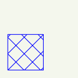

Géométrie surfacique :  
```
Motif de lignes
• espacement : 15 pt
• rotation : 135°

    Ligne simple
    • couleur : RVB 0,0,255 (#0000ff)
    • largeur de trait : 0.8 pt
    • style de jointure : angle droit
    • style de trait : ligne continue

Motif de lignes
• espacement : 15 pt
• rotation : 45°

    Ligne simple
    • couleur : RVB 0,0,255 (#0000ff)
    • largeur de trait : 0.8 pt
    • style de cap : plat
    • style de jointure : angle droit
    • style de trait : ligne continue

Ligne simple
• couleur : RVB 0,0,255 (#0000ff)
• largeur de trait : 0.8 pt
• style de trait : ligne continue
```

Géométrie linéaire :  
*Pas de spécification.*

Géométrie ponctuelle :  
*Pas de spécification.*


### Prescription 33-00

**Secteur de dérogation aux protections des rives des plans d'eau en zone de montagne**
            
- [x] Même symbole que pour les PLU.
- [ ] Apparaît dans la légende nationale PSMV.
        
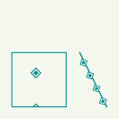

Géométrie surfacique :  
```
Motif de points
• distance horizontale : 30 pt
• distance verticale : 30 pt

    Symbole de police
    • caractère(s) : unicode 178
    • couleur de remplissage : RVB 0,138,140 (#008a8c)
    • famille de police : Wingdings 2
    • taille : 11 pt

Ligne simple
• couleur : RVB 0,138,140 (#008a8c)
• largeur de trait : 0.8 pt
• style de trait : ligne continue
```

Géométrie linéaire :  
```
Ligne de symboles
• décalage le long de la ligne : 9 pt
• intervalle : 12 pt

    Symbole de police
    • caractère(s) : unicode 178
    • couleur de remplissage : RVB 0,138,140 (#008a8c)
    • famille de police : Wingdings 2
    • taille : 9 pt

Ligne simple
• couleur : RVB 0,138,140 (#008a8c)
• largeur de trait : 1 pt
• modèle de tiret personnalisé (tiret ; espace) : 6;6 pt
```

Géométrie ponctuelle :  
*Pas de spécification.*


### Prescription 34-00

**Espaces, paysages et milieux caractéristiques du patrimoine naturel et culturel montagnard à préserver**
            
- [x] Même symbole que pour les PLU.
- [ ] Apparaît dans la légende nationale PSMV.
        
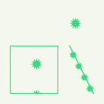

Géométrie surfacique :  
```
Motif de points
• distance horizontale : 30 pt
• distance verticale : 30 pt

    Symbole de police
    • caractère(s) : unicode 240
    • couleur de remplissage : RVB 57,216,129 (#39d881)
    • décalage (en x, en y) : 5,0 pt
    • famille de police : Wingdings 2
    • taille : 16 pt

Ligne simple
• couleur : RVB 57,216,129 (#39d881)
• largeur de trait : 0.8 pt
• style de trait : ligne continue
```

Géométrie linéaire :  
```
Ligne de symboles
• décalage le long de la ligne : 9 pt
• intervalle : 12 pt

    Symbole de police
    • caractère(s) : unicode 240
    • couleur de remplissage : RVB 57,216,129 (#39d881)
    • famille de police : Wingdings 2
    • taille : 11 pt

Ligne simple
• couleur : RVB 57,216,129 (#39d881)
• largeur de trait : 1 pt
• modèle de tiret personnalisé (tiret ; espace) : 6;6 pt
```

Géométrie ponctuelle :  
```
Symbole de police
• caractère(s) : unicode 240
• couleur de remplissage : RVB 57,216,129 (#39d881)
• famille de police : Wingdings 2
• taille : 16 pt
```


### Prescription 35-00

**Terres nécessaires au maintien et au développement des activités agricoles, pastorales et forestières à préserver**
            
- [x] Même symbole que pour les PLU.
- [ ] Apparaît dans la légende nationale PSMV.
        
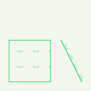

Géométrie surfacique :  
```
Motif de points
• décalage horizontal : 5 pt
• distance horizontale : 17 pt
• distance verticale : 17 pt

    Symbole de police
    • caractère(s) : unicode 237
    • couleur de remplissage : RVB 57,216,119 (#39d877)
    • famille de police : Webdings
    • taille : 10 pt

Ligne simple
• couleur : RVB 57,216,119 (#39d877)
• largeur de trait : 0.8 pt
• style de trait : ligne continue
```

Géométrie linéaire :  
```
Ligne de symboles
• décalage de la ligne : -2 pt
• décalage le long de la ligne : 9 pt
• intervalle : 12 pt

    Symbole de police
    • caractère(s) : unicode 237
    • couleur de remplissage : RVB 57,216,129 (#39d881)
    • famille de police : Webdings
    • point d'ancrage vertical : en dessous
    • taille : 10 pt

Ligne simple
• couleur : RVB 57,216,129 (#39d881)
• largeur de trait : 1 pt
• style de trait : ligne continue
```

Géométrie ponctuelle :  
*Pas de spécification.*


### Prescription 36-00

**Mixité des destinations ou sous-destinations**
            
- [x] Même symbole que pour les PLU.
- [ ] Apparaît dans la légende nationale PSMV.
        
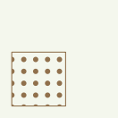

Géométrie surfacique :  
```
Motif de points
• distance horizontale : 10 pt
• distance verticale : 10 pt

    Symbole simple
    • couleur de remplissage : RVB 144,112,76 (#90704c)
    • nom du symbole : circle
    • taille : 4.5 pt

Ligne simple
• couleur : RVB 144,112,76 (#90704c)
• largeur de trait : 0.8 pt
• style de trait : ligne continue
```

Géométrie linéaire :  
*Pas de spécification.*

Géométrie ponctuelle :  
*Pas de spécification.*


### Prescription 37-00

**Règles différenciées entre le rez-de-chaussée et les étages supérieurs des constructions**
            
- [x] Même symbole que pour les PLU.
- [ ] Apparaît dans la légende nationale PSMV.
        
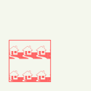

Géométrie surfacique :  
```
Motif de points
• distance horizontale : 15 pt
• distance verticale : 27 pt

    Symbole de police
    • caractère(s) : H (unicode 72)
    • couleur de remplissage : RVB 255,101,101 (#ff6565)
    • famille de police : Webdings
    • taille : 15 pt

Ligne simple
• couleur : RVB 255,101,101 (#ff6565)
• largeur de trait : 0.8 pt
• style de trait : ligne continue
```

Géométrie linéaire :  
*Pas de spécification.*

Géométrie ponctuelle :  
*Pas de spécification.*


### Prescription 37-01

**Règles différenciées pour le rez-de-chaussée en raison des risques inondations**

*Mêmes figurés que le sous-code [37-00](#prescription-37-00).*


### Prescription 37-02

**Règles différenciées pour mixité sociale et fonctionnelle**

*Mêmes figurés que le sous-code [37-00](#prescription-37-00).*


### Prescription 38-00

**Emprise au sol**
            
- [x] Même symbole que pour les PLU.
- [ ] Apparaît dans la légende nationale PSMV.
        
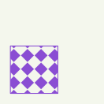

Géométrie surfacique :  
```
Motif de points
• distance horizontale : 13 pt
• distance verticale : 13 pt

    Symbole de police
    • caractère(s) : unicode 191
    • couleur de remplissage : RVB 138,77,211 (#8a4dd3)
    • famille de police : Wingdings 2
    • taille : 17 pt

Ligne simple
• couleur : RVB 138,77,211 (#8a4dd3)
• largeur de trait : 0.8 pt
• style de trait : ligne continue
```

Géométrie linéaire :  
*Pas de spécification.*

Géométrie ponctuelle :  
*Pas de spécification.*


### Prescription 38-01

**Emprise au sol minimale**

*Mêmes figurés que le sous-code [38-00](#prescription-38-00).*


### Prescription 38-02

**Emprise au sol maximale**

*Mêmes figurés que le sous-code [38-00](#prescription-38-00).*


### Prescription 38-97

**Emprise au sol règles qualitatives**

*Mêmes figurés que le sous-code [38-00](#prescription-38-00).*


### Prescription 38-98

**Emprise au sol règles alternatives**

*Mêmes figurés que le sous-code [38-00](#prescription-38-00).*


### Prescription 39-00

**Hauteur**
            
- [x] Même symbole que pour les PLU.
- [ ] Apparaît dans la légende nationale PSMV.
        


Géométrie surfacique :  
```
Motif de points
• distance horizontale : 21 pt
• distance verticale : 26 pt

    Symbole de police
    • caractère(s) : unicode 177
    • couleur de remplissage : RVB 138,77,211 (#8a4dd3)
    • famille de police : Wingdings 3
    • rotation : 90°
    • taille : 18 pt

Ligne simple
• couleur : RVB 138,77,211 (#8a4dd3)
• largeur de trait : 0.8 pt
• style de trait : ligne continue
```

Géométrie linéaire :  
*Pas de spécification.*

Géométrie ponctuelle :  
*Pas de spécification.*


### Prescription 39-01

**Hauteur minimale**

*Mêmes figurés que le sous-code [39-00](#prescription-39-00).*


### Prescription 39-02

**Hauteur maximale**

*Mêmes figurés que le sous-code [39-00](#prescription-39-00).*


### Prescription 39-50

**Hauteur maximale de façade**
            
- [ ] Même symbole que pour les PLU.
- [x] Apparaît dans la légende nationale PSMV.
        


Géométrie surfacique :  
```
Ligne de symboles
• emplacement : sur le point central

    Symbole de police
    • caractère(s) : [txt] (unicode 91)
    • couleur de remplissage : RVB 255,0,0 (#ff0000)
    • décalage (en x, en y) : 0,-1 pt
    • famille de police : Times New Roman
    • taille : 8 pt

    Symbole simple
    • couleur de remplissage : RVB 255,255,255 (#ffffff)
    • couleur de trait : RVB 255,0,0 (#ff0000)
    • largeur de trait : 0.8 pt
    • nom du symbole : square
    • style de trait : ligne continue
    • taille : [8 + 4 * length(txt)] pt

Ligne simple
• couleur : RVB 255,0,0 (#ff0000)
• largeur de trait : 1.5 pt
• style de trait : ligne en pointillé
```

Géométrie linéaire :  
```
Ligne de symboles
• emplacement : sur le point central

    Symbole de police
    • caractère(s) : [txt] (unicode 91)
    • couleur de remplissage : RVB 255,0,0 (#ff0000)
    • décalage (en x, en y) : 0,-1 pt
    • famille de police : Times New Roman
    • taille : 8 pt

    Symbole simple
    • couleur de remplissage : RVB 255,255,255 (#ffffff)
    • couleur de trait : RVB 255,0,0 (#ff0000)
    • largeur de trait : 0.8 pt
    • nom du symbole : square
    • style de trait : ligne continue
    • taille : [8 + 4 * length(txt)] pt

Ligne simple
• couleur : RVB 255,0,0 (#ff0000)
• largeur de trait : 1.5 pt
• style de trait : ligne en pointillé
```

Géométrie ponctuelle :  
*Pas de spécification.*


### Prescription 39-51

**Hauteur maximale de faîtage ou de construction**
            
- [ ] Même symbole que pour les PLU.
- [x] Apparaît dans la légende nationale PSMV.
        


Géométrie surfacique :  
```
Ligne de symboles
• emplacement : sur le point central

    Symbole de police
    • caractère(s) : [txt] (unicode 91)
    • couleur de remplissage : RVB 255,0,0 (#ff0000)
    • décalage (en x, en y) : 0,-2 pt
    • famille de police : Times New Roman
    • point d'ancrage vertical : en dessous
    • taille : 8 pt

    Symbole simple
    • couleur de remplissage : RVB 255,255,255 (#ffffff)
    • couleur de trait : RVB 255,0,0 (#ff0000)
    • décalage (en x, en y) : 0,0.5 pt
    • largeur de trait : 0.8 pt
    • nom du symbole : triangle
    • point d'ancrage : en dessous
    • style de trait : ligne continue
    • taille : [9 + 5 * length(txt)] pt

Ligne simple
• couleur : RVB 255,0,0 (#ff0000)
• largeur de trait : 1.5 pt
• style de trait : ligne en pointillé
```

Géométrie linéaire :  
```
Ligne de symboles
• emplacement : sur le point central

    Symbole de police
    • caractère(s) : [txt] (unicode 91)
    • couleur de remplissage : RVB 255,0,0 (#ff0000)
    • décalage (en x, en y) : 0,-2 pt
    • famille de police : Times New Roman
    • point d'ancrage vertical : en dessous
    • taille : 8 pt

    Symbole simple
    • couleur de remplissage : RVB 255,255,255 (#ffffff)
    • couleur de trait : RVB 255,0,0 (#ff0000)
    • décalage (en x, en y) : 0,0.5 pt
    • largeur de trait : 0.8 pt
    • nom du symbole : triangle
    • point d'ancrage : en dessous
    • style de trait : ligne continue
    • taille : [9 + 5 * length(txt)] pt

Ligne simple
• couleur : RVB 255,0,0 (#ff0000)
• largeur de trait : 1.5 pt
• style de trait : ligne en pointillé
```

Géométrie ponctuelle :  
*Pas de spécification.*


### Prescription 39-52

**Hauteur imposée de façade**
            
- [ ] Même symbole que pour les PLU.
- [x] Apparaît dans la légende nationale PSMV.
        


Géométrie surfacique :  
```
Ligne de symboles
• emplacement : sur le point central

    Symbole de police
    • caractère(s) : [txt] (unicode 91)
    • couleur de remplissage : RVB 255,0,0 (#ff0000)
    • décalage (en x, en y) : 0,-1 pt
    • famille de police : Times New Roman
    • taille : 8 pt

    Symbole simple
    • couleur de remplissage : RVB 255,255,255 (#ffffff)
    • couleur de trait : RVB 255,0,0 (#ff0000)
    • largeur de trait : 0.8 pt
    • nom du symbole : square
    • style de trait : ligne continue
    • taille : [8 + 4 * length(txt)] pt

Ligne simple
• couleur : RVB 255,0,0 (#ff0000)
• largeur de trait : 1.5 pt
• style de trait : ligne continue
```

Géométrie linéaire :  
```
Ligne de symboles
• emplacement : sur le point central

    Symbole de police
    • caractère(s) : [txt] (unicode 91)
    • couleur de remplissage : RVB 255,0,0 (#ff0000)
    • décalage (en x, en y) : 0,-1 pt
    • famille de police : Times New Roman
    • taille : 8 pt

    Symbole simple
    • couleur de remplissage : RVB 255,255,255 (#ffffff)
    • couleur de trait : RVB 255,0,0 (#ff0000)
    • largeur de trait : 0.8 pt
    • nom du symbole : square
    • style de trait : ligne continue
    • taille : [8 + 4 * length(txt)] pt

Ligne simple
• couleur : RVB 255,0,0 (#ff0000)
• largeur de trait : 1.5 pt
• style de trait : ligne continue
```

Géométrie ponctuelle :  
*Pas de spécification.*


### Prescription 39-97

**Hauteur règles qualitatives**

*Mêmes figurés que le sous-code [39-00](#prescription-39-00).*


### Prescription 39-98

**Hauteur règles alternatives**

*Mêmes figurés que le sous-code [39-00](#prescription-39-00).*


### Prescription 40-00

**Volumétrie**
            
- [x] Même symbole que pour les PLU.
- [ ] Apparaît dans la légende nationale PSMV.
        


Géométrie surfacique :  
```
Motif de points
• distance horizontale : 27 pt
• distance verticale : 31 pt

    Symbole de police
    • caractère(s) : unicode 135
    • couleur de remplissage : RVB 138,77,211 (#8a4dd3)
    • famille de police : Wingdings 3
    • taille : 15 pt

Ligne simple
• couleur : RVB 138,77,211 (#8a4dd3)
• largeur de trait : 0.8 pt
• style de trait : ligne continue
```

Géométrie linéaire :  
*Pas de spécification.*

Géométrie ponctuelle :  
*Pas de spécification.*


### Prescription 40-01

**Volumétrie minimale**

*Mêmes figurés que le sous-code [40-00](#prescription-40-00).*


### Prescription 40-02

**Volumétrie maximale**

*Mêmes figurés que le sous-code [40-00](#prescription-40-00).*


### Prescription 40-50

**Point de vue, perspective à préserver et à mettre en valeur**
            
- [ ] Même symbole que pour les PLU.
- [x] Apparaît dans la légende nationale PSMV.
        


Géométrie surfacique :  
*Pas de spécification.*

Géométrie linéaire :  
*Pas de spécification.*

Géométrie ponctuelle :  
```
Symbole SVG
• fichier : /PSMV/SVG/psmv_psc_40_50.svg
• rotation : [angle]°
• taille : 30 pt
```


### Prescription 40-97

**Règles volumétriques qualitatives**

*Mêmes figurés que le sous-code [40-00](#prescription-40-00).*


### Prescription 40-98

**Règles volumétriques alternatives**

*Mêmes figurés que le sous-code [40-00](#prescription-40-00).*


### Prescription 41-00

**Aspect extérieur**
            
- [x] Même symbole que pour les PLU.
- [ ] Apparaît dans la légende nationale PSMV.
        


Géométrie surfacique :  
```
Motif de points
• distance horizontale : 10 pt
• distance verticale : 11 pt

    Symbole de police
    • caractère(s) : p (unicode 112)
    • couleur de remplissage : RVB 253,191,111 (#fdbf6f)
    • famille de police : Wingdings 3
    • taille : 9 pt

Ligne simple
• couleur : RVB 253,191,111 (#fdbf6f)
• largeur de trait : 0.8 pt
• style de trait : ligne continue
```

Géométrie linéaire :  
```
Ligne de symboles
• décalage le long de la ligne : 9 pt
• intervalle : 12 pt

    Symbole de police
    • caractère(s) : p (unicode 112)
    • couleur de remplissage : RVB 253,191,111 (#fdbf6f)
    • famille de police : Wingdings 3
    • point d'ancrage vertical : en dessous
    • taille : 9 pt

Ligne simple
• couleur : RVB 253,191,111 (#fdbf6f)
• largeur de trait : 1 pt
• style de trait : ligne continue
```

Géométrie ponctuelle :  
*Pas de spécification.*


### Prescription 41-01

**Aspect extérieur façades**

*Mêmes figurés que le sous-code [41-00](#prescription-41-00).*


### Prescription 41-02

**Aspect extérieur toitures**

*Mêmes figurés que le sous-code [41-00](#prescription-41-00).*


### Prescription 41-03

**Aspect extérieur clôtures**

*Mêmes figurés que le sous-code [41-00](#prescription-41-00).*


### Prescription 41-98

**Aspect extérieur règles alternatives**

*Mêmes figurés que le sous-code [41-00](#prescription-41-00).*


### Prescription 42-00

**Coefficient de biotope par surface**
            
- [x] Même symbole que pour les PLU.
- [ ] Apparaît dans la légende nationale PSMV.
        


Géométrie surfacique :  
```
Motif de points
• distance horizontale : 17 pt
• distance verticale : 17 pt

    Symbole de police
    • caractère(s) : unicode 225
    • couleur de remplissage : RVB 86,170,2 (#56aa02)
    • famille de police : Wingdings 2
    • taille : 16 pt

Ligne simple
• couleur : RVB 86,170,2 (#56aa02)
• largeur de trait : 0.8 pt
• style de trait : ligne continue
```

Géométrie linéaire :  
*Pas de spécification.*

Géométrie ponctuelle :  
*Pas de spécification.*


### Prescription 43-00

**Réalisation d'espaces libres, plantations, aires de jeux et de loisirs**
            
- [x] Même symbole que pour les PLU.
- [ ] Apparaît dans la légende nationale PSMV.
        


Géométrie surfacique :  
```
Motif de lignes
• espacement : 11 pt
• rotation : 135°

    Ligne simple
    • couleur : RVB 255,127,0 (#ff7f00)
    • largeur de trait : 0.8 pt
    • style de trait : ligne continue

Motif de lignes
• espacement : 11 pt
• rotation : 45°

    Ligne simple
    • couleur : RVB 255,127,0 (#ff7f00)
    • largeur de trait : 0.8 pt
    • style de trait : ligne continue

Ligne simple
• couleur : RVB 255,127,0 (#ff7f00)
• largeur de trait : 0.8 pt
• style de trait : ligne continue
```

Géométrie linéaire :  
```
Ligne de symboles
• intervalle : 7 pt

    Symbole simple
    • couleur de trait : RVB 255,127,0 (#ff7f00)
    • largeur de trait : 0.8 pt
    • nom du symbole : cross2
    • style de jointure : angle droit
    • style de trait : ligne continue
    • taille : 4 pt
```

Géométrie ponctuelle :  
*Pas de spécification.*


### Prescription 43-01

**Réalisation d'espaces libres**

*Mêmes figurés que le sous-code [43-00](#prescription-43-00).*


### Prescription 43-02

**Réalisation d'aires de jeux et de loisirs**

*Mêmes figurés que le sous-code [43-00](#prescription-43-00).*


### Prescription 43-03

**Règlementation des plantations**

*Mêmes figurés que le sous-code [43-00](#prescription-43-00).*


### Prescription 43-50

**Espace vert à créer**
            
- [ ] Même symbole que pour les PLU.
- [x] Apparaît dans la légende nationale PSMV.
        


Géométrie surfacique :  
```
Motif de lignes
• décalage : 2 pt
• espacement : 5 pt
• rotation : 45°

    Ligne simple
    • couleur : RVB 90,140,40 (#5a8c28)
    • largeur de trait : 0.8 pt
    • style de trait : ligne continue

Motif de lignes
• espacement : 5 pt
• rotation : 45°

    Ligne simple
    • couleur : RVB 90,140,40 (#5a8c28)
    • largeur de trait : 0.8 pt
    • style de trait : ligne continue

Ligne simple
• couleur : RVB 90,140,40 (#5a8c28)
• largeur de trait : 0.8 pt
• style de trait : ligne continue
```

Géométrie linéaire :  
*Pas de spécification.*

Géométrie ponctuelle :  
*Pas de spécification.*


### Prescription 43-51

**Place, cour, ou autre espace libre à dominante minérale à créer**
            
- [ ] Même symbole que pour les PLU.
- [x] Apparaît dans la légende nationale PSMV.
        


Géométrie surfacique :  
```
Motif de lignes
• décalage : 2 pt
• espacement : 5 pt
• rotation : 135°

    Ligne simple
    • couleur : RVB 100,50,0 (#643200)
    • largeur de trait : 0.8 pt
    • style de trait : ligne continue

Motif de lignes
• espacement : 5 pt
• rotation : 135°

    Ligne simple
    • couleur : RVB 100,50,0 (#643200)
    • largeur de trait : 0.8 pt
    • style de trait : ligne continue

Ligne simple
• couleur : RVB 100,50,0 (#643200)
• largeur de trait : 0.8 pt
• style de trait : ligne continue
```

Géométrie linéaire :  
*Pas de spécification.*

Géométrie ponctuelle :  
*Pas de spécification.*


### Prescription 44-00

**Stationnement**
            
- [x] Même symbole que pour les PLU.
- [ ] Apparaît dans la légende nationale PSMV.
        


Géométrie surfacique :  
```
Motif de points
• distance horizontale : 13 pt
• distance verticale : 13 pt

    Symbole simple
    • couleur de remplissage : RVB 143,143,143 (#8f8f8f)
    • nom du symbole : equilateral_triangle
    • taille : 9 pt

Ligne simple
• couleur : RVB 128,128,128 (#808080)
• largeur de trait : 0.8 pt
• style de trait : ligne continue
```

Géométrie linéaire :  
*Pas de spécification.*

Géométrie ponctuelle :  
*Pas de spécification.*


### Prescription 44-01

**Stationnement minimal**

*Mêmes figurés que le sous-code [44-00](#prescription-44-00).*


### Prescription 44-02

**Stationnement maximal**

*Mêmes figurés que le sous-code [44-00](#prescription-44-00).*


### Prescription 44-03

**Caractéristiques et type de stationnement**

*Mêmes figurés que le sous-code [44-00](#prescription-44-00).*


### Prescription 44-04

**Minoration des règles de stationnement**

*Mêmes figurés que le sous-code [44-00](#prescription-44-00).*


### Prescription 44-05

**Réalisation d'aires de livraisons imposée**

*Mêmes figurés que le sous-code [44-00](#prescription-44-00).*


### Prescription 44-98

**Stationnement règles alternatives**

*Mêmes figurés que le sous-code [44-00](#prescription-44-00).*


### Prescription 45-00

**Zone d'aménagement concerté (surface de plancher, destination)**
            
- [x] Même symbole que pour les PLU.
- [ ] Apparaît dans la légende nationale PSMV.
        


Géométrie surfacique :  
```
Remplissage simple
• couleur de remplissage : RVB 255,127,127 (#ff7f7f), transparence 40%
• couleur de trait : RVB 255,0,0 (#ff0000)
• largeur de trait : 1 pt
• style de trait : ligne continue
```

Géométrie linéaire :  
*Pas de spécification.*

Géométrie ponctuelle :  
*Pas de spécification.*


### Prescription 46-00

**Constructibilité espace boisé antérieur au 20e siècle**
            
- [x] Même symbole que pour les PLU.
- [ ] Apparaît dans la légende nationale PSMV.
        


Géométrie surfacique :  
```
Motif de points
• distance horizontale : 8.45 pt
• distance verticale : 8.45 pt

    Symbole simple
    • couleur de remplissage : RVB 204,204,204 (#cccccc)
    • couleur de trait : RVB 86,170,2 (#56aa02)
    • largeur de trait : 0.9 pt
    • nom du symbole : circle
    • style de trait : ligne continue
    • taille : 8 pt

Ligne simple
• couleur : RVB 86,170,2 (#56aa02)
• largeur de trait : 0.8 pt
• style de trait : ligne continue
```

Géométrie linéaire :  
*Pas de spécification.*

Géométrie ponctuelle :  
*Pas de spécification.*


### Prescription 47-00

**Desserte par les réseaux**
            
- [x] Même symbole que pour les PLU.
- [ ] Apparaît dans la légende nationale PSMV.
        


Géométrie surfacique :  
```
Motif de points
• distance horizontale : 25 pt
• distance verticale : 25 pt

    Symbole de police
    • caractère(s) : ~ (unicode 126)
    • couleur de remplissage : RVB 115,38,0 (#732600)
    • famille de police : Webdings
    • taille : 12 pt

Ligne simple
• couleur : RVB 115,38,0 (#732600)
• largeur de trait : 0.8 pt
• style de trait : ligne continue
```

Géométrie linéaire :  
```
Ligne de symboles
• décalage de la ligne : -2 pt
• décalage le long de la ligne : 16.5 pt
• intervalle : 22 pt

    Symbole de police
    • caractère(s) : ~ (unicode 126)
    • couleur de remplissage : RVB 115,38,0 (#732600)
    • famille de police : Webdings
    • taille : 12 pt

Ligne simple
• couleur : RVB 115,38,0 (#732600)
• largeur de trait : 1 pt
• modèle de tiret personnalisé (tiret ; espace) : 11;11 pt
```

Géométrie ponctuelle :  
```
Symbole de police
• caractère(s) : ~ (unicode 126)
• couleur de remplissage : RVB 115,38,0 (#732600)
• famille de police : Webdings
• taille : 14 pt
```


### Prescription 47-01

**Réseaux publics d'eau**

*Mêmes figurés que le sous-code [47-00](#prescription-47-00).*


### Prescription 47-02

**Réseaux publics d'électricité**

*Mêmes figurés que le sous-code [47-00](#prescription-47-00).*


### Prescription 47-03

**Réseaux publics d'assainissement**

*Mêmes figurés que le sous-code [47-00](#prescription-47-00).*


### Prescription 47-04

**Conditions de réalisation d'un assainissement non collectif**

*Mêmes figurés que le sous-code [47-00](#prescription-47-00).*


### Prescription 47-05

**Infrastructures et réseaux de communication électroniques**

*Mêmes figurés que le sous-code [47-00](#prescription-47-00).*


### Prescription 48-00

**Mesures pour limiter l'imperméabilité des sols**
            
- [x] Même symbole que pour les PLU.
- [ ] Apparaît dans la légende nationale PSMV.
        


Géométrie surfacique :  
```
Motif de points
• distance horizontale : 22 pt
• distance verticale : 22 pt

    Symbole de police
    • caractère(s) : S (unicode 83)
    • couleur de remplissage : RVB 0,76,115 (#004c73)
    • famille de police : Wingdings
    • taille : 12 pt

Ligne simple
• couleur : RVB 0,76,115 (#004c73)
• largeur de trait : 0.8 pt
• style de trait : ligne continue
```

Géométrie linéaire :  
```
Ligne de symboles
• décalage de la ligne : -2 pt
• décalage le long de la ligne : 16.5 pt
• intervalle : 22 pt

    Symbole de police
    • caractère(s) : S (unicode 83)
    • couleur de remplissage : RVB 0,76,115 (#004c73)
    • famille de police : Wingdings
    • taille : 14 pt

Ligne simple
• couleur : RVB 0,76,115 (#004c73)
• largeur de trait : 1 pt
• modèle de tiret personnalisé (tiret ; espace) : 11;11 pt
```

Géométrie ponctuelle :  
```
Symbole de police
• caractère(s) : S (unicode 83)
• couleur de remplissage : RVB 0,76,115 (#004c73)
• famille de police : Wingdings
• taille : 14 pt
```


### Prescription 48-01

**Installations nécessaires à la gestion des eaux pluviales et du ruissellement**

*Mêmes figurés que le sous-code [48-00](#prescription-48-00).*


### Prescription 49-00

**Opération d'ensemble imposée en zone AU**
            
- [x] Même symbole que pour les PLU.
- [ ] Apparaît dans la légende nationale PSMV.
        


Géométrie surfacique :  
```
Motif de points
• distance horizontale : 26 pt
• distance verticale : 26 pt

    Symbole de police
    • caractère(s) : unicode 249
    • couleur de remplissage : RVB 255,101,100 (#ff6564)
    • famille de police : Wingdings 2
    • taille : 16 pt

Ligne simple
• couleur : RVB 255,101,100 (#ff6564)
• largeur de trait : 0.8 pt
• style de trait : ligne continue
```

Géométrie linéaire :  
*Pas de spécification.*

Géométrie ponctuelle :  
*Pas de spécification.*


### Prescription 49-01

**Urbanisation par opération d'ensemble**

*Mêmes figurés que le sous-code [49-00](#prescription-49-00).*


### Prescription 49-02

**Urbanisation conditionnée à la réalisation des équipements internes à la zone**

*Mêmes figurés que le sous-code [49-00](#prescription-49-00).*


### Prescription 50-00

**Interdiction types d'activités, destinations, sous-destinations**
            
- [x] Même symbole que pour les PLU.
- [ ] Apparaît dans la légende nationale PSMV.
        


Géométrie surfacique :  
```
Motif de points
• distance horizontale : 20 pt
• distance verticale : 20 pt

    Symbole de police
    • caractère(s) : X (unicode 88)
    • couleur de remplissage : RVB 148,10,189 (#940abd)
    • famille de police : Wingdings 2
    • taille : 9 pt

Ligne simple
• couleur : RVB 148,10,189 (#940abd)
• largeur de trait : 0.8 pt
• style de trait : ligne continue
```

Géométrie linéaire :  
```
Ligne de symboles
• décalage le long de la ligne : 9 pt
• intervalle : 12 pt

    Symbole de police
    • caractère(s) : X (unicode 88)
    • couleur de remplissage : RVB 148,10,189 (#940abd)
    • famille de police : Wingdings 2
    • taille : 9 pt

Ligne simple
• couleur : RVB 148,10,189 (#940abd)
• largeur de trait : 1 pt
• modèle de tiret personnalisé (tiret ; espace) : 6;6 pt
```

Géométrie ponctuelle :  
```
Symbole de police
• caractère(s) : X (unicode 88)
• couleur de remplissage : RVB 148,10,189 (#940abd)
• famille de police : Wingdings 2
• taille : 14 pt
```


### Prescription 51-00

**Autorisation sous conditions types d'activités, destinations, sous-destinations**
            
- [x] Même symbole que pour les PLU.
- [ ] Apparaît dans la légende nationale PSMV.
        


Géométrie surfacique :  
```
Motif de points
• distance horizontale : 20 pt
• distance verticale : 20 pt

    Symbole de police
    • caractère(s) : R (unicode 82)
    • couleur de remplissage : RVB 148,10,189 (#940abd)
    • famille de police : Wingdings 2
    • taille : 9 pt

Ligne simple
• couleur : RVB 148,10,189 (#940abd)
• largeur de trait : 0.8 pt
• style de trait : ligne continue
```

Géométrie linéaire :  
```
Ligne de symboles
• décalage le long de la ligne : 9 pt
• intervalle : 12 pt

    Symbole de police
    • caractère(s) : R (unicode 82)
    • couleur de remplissage : RVB 148,10,189 (#940abd)
    • famille de police : Wingdings 2
    • taille : 9 pt

Ligne simple
• couleur : RVB 148,10,189 (#940abd)
• largeur de trait : 1 pt
• modèle de tiret personnalisé (tiret ; espace) : 6;6 pt
```

Géométrie ponctuelle :  
```
Symbole de police
• caractère(s) : R (unicode 82)
• couleur de remplissage : RVB 148,10,189 (#940abd)
• famille de police : Wingdings 2
• taille : 14 pt
```


### Prescription 52-00

**Infrastructures et équipements logistiques à préserver ou à développer en zones U et AU**
            
- [x] Même symbole que pour les PLU.
- [ ] Apparaît dans la légende nationale PSMV.
        


Géométrie surfacique :  
```
Motif de points
• distance horizontale : 25 pt
• distance verticale : 25 pt

    Symbole de police
    • caractère(s) : q (unicode 113)
    • couleur de remplissage : RVB 172,87,13 (#ac570d)
    • famille de police : Webdings
    • taille : 11 pt

Ligne simple
• couleur : RVB 172,87,13 (#ac570d)
• largeur de trait : 0.8 pt
• style de trait : ligne continue
```

Géométrie linéaire :  
*Pas de spécification.*

Géométrie ponctuelle :  
*Pas de spécification.*


### Prescription 97-00

**Périmètre d'application d'une pièce écrite territorialisée (rapport de présentation, PADD, règlement, règlement graphique, POA)**
            
- [x] Même symbole que pour les PLU.
- [ ] Apparaît dans la légende nationale PSMV.
        


Géométrie surfacique :  
```
Remplissage simple
• style de remplissage : pas de remplissage
• style de trait : pas de ligne
```

Géométrie linéaire :  
*Pas de spécification.*

Géométrie ponctuelle :  
*Pas de spécification.*


### Prescription 97-01

**Périmètre couvert par un plan de secteur**
            
- [x] Même symbole que pour les PLU.
- [ ] Apparaît dans la légende nationale PSMV.
        


Géométrie surfacique :  
```
Ligne simple
• couleur : RVB 0,0,0 (#000000)
• largeur de trait : 2 pt
• style de trait : ligne tiret-point-point
```

Géométrie linéaire :  
*Pas de spécification.*

Géométrie ponctuelle :  
*Pas de spécification.*


### Prescription 99-00

**Autre**
            
- [x] Même symbole que pour les PLU.
- [ ] Apparaît dans la légende nationale PSMV.
        


Géométrie surfacique :  
```
Remplissage simple
• couleur de trait : RVB 0,0,0 (#000000)
• largeur de trait : 2 pt
• style de remplissage : pas de remplissage
• style de trait : ligne continue
```

Géométrie linéaire :  
```
Ligne simple
• couleur : RVB 0,0,0 (#000000)
• largeur de trait : 2 pt
• style de trait : ligne continue
```

Géométrie ponctuelle :  
```
Symbole simple
• couleur de remplissage : RVB 0,0,0 (#000000)
• nom du symbole : circle
• taille : 6 pt
```


### Prescription 99-01

**Autre : affectation des sols et destination des constructions**

*Mêmes figurés que le sous-code [99-00](#prescription-99-00).*


### Prescription 99-02

**Autre : zones naturelles, agricoles ou forestières**

*Mêmes figurés que le sous-code [99-00](#prescription-99-00).*


### Prescription 99-03

**Autre : mixité sociale et fonctionnelle en zones urbaines ou à urbaniser**

*Mêmes figurés que le sous-code [99-00](#prescription-99-00).*


### Prescription 99-04

**Autre : qualité du cadre de vie**

*Mêmes figurés que le sous-code [99-00](#prescription-99-00).*


### Prescription 99-05

**Autre : qualité urbaine, architecturale, environnementale et paysagère**

*Mêmes figurés que le sous-code [99-00](#prescription-99-00).*


### Prescription 99-06

**Autre : traitement environnemental et paysager des esapces non bâtis et abords des constructions**

*Mêmes figurés que le sous-code [99-00](#prescription-99-00).*


### Prescription 99-07

**Autre : densité**

*Mêmes figurés que le sous-code [99-00](#prescription-99-00).*


### Prescription 99-08

**Autre : équipements, réseaux et emplacement réservés**

*Mêmes figurés que le sous-code [99-00](#prescription-99-00).*


### Prescription 99-09

**Autre : plan local d'urbanisme tenant lieu de programme local de l'habitat et de plan de déplacements urbains**

*Mêmes figurés que le sous-code [99-00](#prescription-99-00).*


### Prescription 99-10

**Autre : plan local d'urbanisme tenant lieu de programme de déplacements urbains**

*Mêmes figurés que le sous-code [99-00](#prescription-99-00).*